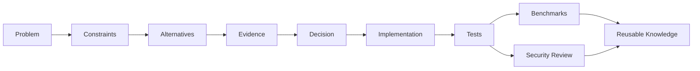

# ENGINEERING KNOWLEDGE

### Evidence-Driven Software Engineering Knowledge Base

> A human-readable and agent-readable engineering memory for choosing reliable, secure and efficient solutions from evidence rather than intuition alone.

This repository is the staging home for the future **`engineering-knowledge`** knowledge base. It is designed for both engineers and autonomous agents working across **Python, Go and C++**, algorithms, architecture, testing, performance, reliability, DevSecOps and application security.

## Core principle

The preferred solution is not automatically the fastest, newest or shortest. It is the **smallest reliable solution that satisfies the actual constraints**, with explicit trade-offs and evidence.

Every important engineering choice should be traceable through:

`Problem → Context → Constraints → Alternatives → Evidence → Decision → Implementation → Tests → Security Review → Measurement`

## Knowledge domains

- **Languages** — Python, Go, C++.
- **Algorithms & Data Structures** — selection rules, complexity, alternatives and implementations.
- **Architecture** — patterns, ADRs, trade-offs and system design.
- **Databases & Networking** — reliable storage, protocols and distributed communication.
- **Concurrency & Performance** — measurement-driven optimization and scalability.
- **Testing & Verification** — correctness, regression, fuzzing, property tests and benchmarks.
- **Reliability** — failure modes, resilience, observability and recovery.
- **DevSecOps & AppSec** — secure defaults, dependency risk, CI/CD controls and attack surface reduction.
- **Problems** — structured problem sets with multiple candidate solutions.
- **Sources** — standards, official documentation, books, papers, university research and engineering reports.

## Knowledge object model

Each important topic should be represented as a set of linked objects:



## Standard repository layout

```text
engineering-knowledge/
├── .ai/
│   └── manifest.yaml
├── languages/
│   ├── python/
│   ├── go/
│   └── cpp/
├── algorithms/
├── data-structures/
├── architecture/
├── databases/
├── networking/
├── concurrency/
├── testing/
├── performance/
├── reliability/
├── devsecops/
├── application-security/
├── problems/
├── benchmarks/
├── experiments/
├── decisions/
├── sources/
└── templates/
```

## Evidence levels

Preferred evidence order:

1. **Primary specifications and official documentation** — language specs, standards, RFCs, official releases.
2. **Peer-reviewed research and recognized academic work**.
3. **Authoritative books and conference material**.
4. **Vendor engineering documentation and reproducible technical reports**.
5. **Independent benchmarks and engineering articles**.
6. **Community sources** only as hypotheses or supporting context, not as sole authority for critical decisions.

Evidence must record provenance, date/version and applicability.

## Decision quality

Candidates may be assessed across:

- correctness;
- reliability;
- security;
- performance;
- memory use;
- maintainability;
- complexity;
- portability;
- testability;
- observability;
- operational cost;
- dependency risk.

A score is never enough by itself. Every score must be labeled as **MEASURED**, **DOCUMENTED**, **DERIVED**, **EXPERT_ESTIMATE** or **UNKNOWN**.

## For humans and agents

**Human interface:** concise README pages, diagrams, examples, comparisons, references and problem walkthroughs.

**Agent interface:** structured YAML metadata, stable IDs, relationship graphs, evidence records, selection rules and confidence/provenance fields.

## Portfolio navigation

← [Viktor Kulichenko Engineering Portfolio](https://github.com/VictorKVS/VictorKVS)

Related systems: [MindForge](https://github.com/VictorKVS/MindForge) · [SecGraph](https://github.com/VictorKVS/SecGraph) · [AI Neural Networks](https://github.com/VictorKVS/AI_Neural_Networks)

---

**Status:** architecture foundation / active build
