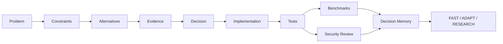
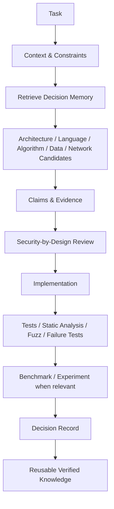

# ENGINEERING KNOWLEDGE

### Evidence-Driven Software Engineering Knowledge Base

> A human-readable and agent-readable engineering memory for choosing reliable, secure and efficient solutions from evidence rather than intuition alone.

This repository is the staging home for the future **`engineering-knowledge`** knowledge base. It is designed for both engineers and autonomous agents working across **Python, Go and C++**, algorithms, architecture, data, networking, reliability, testing, performance, DevSecOps and application security.

## Core principle

The goal is **not the most obvious or commonly accepted solution**. The goal is the **smallest reliable solution that satisfies the actual constraints**: sufficiently fast, secure, resilient, maintainable and explainable, with explicit trade-offs and verifiable evidence.

If a less obvious approach is better supported by research, official documentation, standards or reproducible experiments, the agent should prefer it and explain why it is more appropriate than the conventional alternative.

Every important engineering choice should be traceable through:

`Problem → Context → Constraints → Alternatives → Evidence → Decision → Implementation → Tests → Security Review → Measurement → Decision Memory`

## Knowledge Intelligence Core — мозг FATHER

Поисковые, исследовательские и OSINT-структуры FATHER образуют его **интеллектуальное ядро**. Они непрерывно отслеживают современные исследования, новые стандарты, технологии, библиотеки, алгоритмы, уязвимости, практики и отраслевой опыт. Их задача — не просто собирать информацию, а превращать её в проверяемую инженерную память.

> Новизна обнаруживается быстро, но в рабочий контур допускаются прежде всего устойчивые, надёжные и воспроизводимые решения. Передовые методы сохраняются как кандидаты и проходят сравнение с проверенными альтернативами в конкретной задаче и среде.

Рабочий принцип:

```
SEARCH / OSINT / SCIENCE
→ provenance и legal check
→ claims, условия и ограничения
→ сравнение алгоритмов и комбинаций
→ sandbox / benchmark / reproduction
→ verified pattern или rejected hypothesis
→ skill / agent / workflow
→ production outcome
→ обновлённая Decision Memory
```

FATHER не ищет один «лучший алгоритм вообще». Он выбирает **подходящую комбинацию для конкретной задачи** с учётом качества, безопасности, устойчивости, стоимости, задержки, оборудования, данных и возможности отката. Лучшие подтверждённые комбинации становятся Golden Patterns; отрицательные результаты и границы применимости сохраняются, чтобы агенты не повторяли уже исследованные ошибки.

Это наиболее ценный слой системы — её **мозг, знания и интеллектуальные активы**. Поэтому для каждого знания обязательны стабильный ID, источник, версия, доказательство, область применимости, уровень зрелости и история проверок. Популярность, GitHub stars или громкое название не заменяют доказательств.

Подробности:

- [**FATHER Search & Analytics Center**](docs/FATHER_SEARCH_ANALYTICS_CENTER_PRODUCT.md) — самостоятельный поисково-аналитический центр, научно-OSINT полигон и фабрика проверенных знаний. [Открыть сайт продукта](https://father-search-analytics.cocmosxx2.chatgpt.site).
- [**FATHER Analytical Center**](docs/FATHER_ANALYTICAL_CENTER_PRODUCT.md) — отдельный мыслительный контур: выводы, гипотезы, сценарии, экономические расчёты, визуализации, решения и возврат опыта в базы знаний.
- [Конвейер знаний, обучения и фабрика агентов](docs/FATHER_KNOWLEDGE_ACQUISITION_AND_AGENT_FACTORY_PLAN.md) — что ищем, как извлекаем, храним, связываем, проверяем, комбинируем и превращаем в навыки и агентов.
- [Реестр библиотек и источников FATHER](docs/FATHER_LIBRARY_REGISTRY.md) — нормативные, научные, инженерные, OSINT, ML/RL, orchestration и eval-источники.
- [Модульный продуктовый план FATHER](docs/FATHER_MODULAR_PRODUCT_PLAN.md) — как интеллектуальное ядро превращается в самостоятельные продукты и компоненты.

## Центральные интеллектуальные продукты

| Продукт | Роль в FATHER | Что принимает | Что производит | Текущий этап |
|---|---|---|---|---|
| [Search & Analytics Center](docs/FATHER_SEARCH_ANALYTICS_CENTER_PRODUCT.md) | органы чувств и разведка | Web, science, standards, code, lawful OSINT | verified information packages, sources, evidence | M0 → полигон 152-ФЗ |
| [Analytical Center](docs/FATHER_ANALYTICAL_CENTER_PRODUCT.md) | мышление и Decision Intelligence | документы, таблицы, события, графы, verified OSINT | выводы, гипотезы, сценарии, экономика, dashboards, решения | M0 → workbench |
| Knowledge Bases | доказательная память | sources, claims, requirements, experiments | связанные версионированные узлы | Security KB build |
| Decision Memory | производственный опыт | решения и фактические outcomes | Golden Patterns, ограничения, negative results | architecture |
| Agent Factory | исполнение и масштабирование | skills, KB, tools, eval | проверенные версии агентов и workflows | planned integration |

### Непрерывное совершенствование FATHER

| Анализируем | Метрики | Проверяемое улучшение |
|---|---|---|
| код | defects, coverage, complexity, performance, dependency risk | refactoring, алгоритмы, библиотеки |
| архитектуру | coupling, latency, reliability, cost, security | контракты, topology, decomposition |
| базы знаний | coverage, freshness, conflicts, retrieval quality | источники, ontology, chunking, links |
| агентов и навыки | task success, factuality, safety, cost, stability | prompt, tools, workflow, SFT/RL candidate |
| технологии | benchmark, maturity, compatibility, TCO | adopt, adapt, retain или reject |

`OBSERVE → HYPOTHESIS → BASELINE → A/B + GOLDEN/ADVERSARIAL TESTS → INDEPENDENT VERIFY → HUMAN GATE → CANARY → OUTCOME → GOLDEN PATTERN / ROLLBACK`

Самоизменение без независимой проверки, журнала, canary и human approval запрещено.

## Knowledge domains

- [**Security Knowledge Base**](security-knowledge/README.md) — document-first regulatory knowledge graph: complete source/version history, structural chunks, definitions, atomic requirements, intra/inter-document links, applicability, controls, checks, evidence, audit, FSTEC/FSB solution registries, future security architecture and development roadmap.
- [**Languages**](languages/README.md) — Python, Go, C++ and cross-language selection.
- [**Algorithms & Data Structures**](algorithms/README.md) — selection rules, complexity, alternatives and implementations.
- [**Architecture**](architecture/README.md) — topology, decomposition, ADRs and system boundaries.
- [**Databases**](databases/README.md) — data models, consistency, transactions, indexing and recovery.
- [**Networking**](networking/README.md) — protocols, trust boundaries, retries, timeouts and transport behaviour.
- [**Testing & Verification**](testing/README.md) — correctness, regression, fuzzing, static analysis and failure tests.
- [**Performance**](performance/README.md) — measurement-driven optimization and workload-specific benchmarking.
- [**Reliability**](reliability/README.md) — failure models, graceful degradation, recovery and resilience.
- [**DevSecOps**](devsecops/README.md) & [**Application Security**](application-security/README.md) — secure defaults, dependency risk, CI/CD controls and attack surface reduction.
- **Problems** — structured problem sets with multiple candidate solutions.
- **Sources & Claims** — standards, official documentation, books, papers, claims, contradictions and applicability.
- [**Decision Memory**](decision-memory/README.md) — verified reusable experience for FAST / ADAPT / RESEARCH paths.

## Security Knowledge: current priority

The immediate priority is the **primary document corpus**, not premature architecture automation.

`Official source → immutable version → normalized text → document structure → chunks → definitions → atomic requirements → typed graph relationships → applicability → controls/checks/evidence`

Later registered development tracks add authoritative FSTEC/FSB product, certificate, licence and hardware/software registries; organization Current State; security audit; alternatives and cost/TCO; target security architecture; development roadmap; and controlled automatic regulatory updates with impact and weight recalculation.

See the full specification and development registry in [security-knowledge/README.md](security-knowledge/README.md).

## Knowledge object model



## System-level decision flow



Machine-readable policies live in `.ai/`, including retrieval, language selection, evidence, security-by-design and system-level decision policies.

## Evidence levels

Preferred evidence order:

1. **Primary specifications and official documentation** — language specs, standards, RFCs, official releases.
2. **Peer-reviewed research and recognized academic work**.
3. **Authoritative books and conference material**.
4. **Vendor engineering documentation and reproducible technical reports**.
5. **Independent benchmarks and engineering articles**.
6. **Community sources** only as hypotheses or supporting context, not as sole authority for critical decisions.

Evidence must record provenance, date/version and applicability.

## Decision quality

Candidates may be assessed across correctness, reliability, security, performance, memory use, maintainability, complexity, portability, testability, observability, operational cost and dependency risk.

A score is never enough by itself. Every score must be labeled as **MEASURED**, **DOCUMENTED**, **DERIVED**, **EXPERT_ESTIMATE** or **UNKNOWN**.

## For humans and agents

**Human interface:** concise README pages, diagrams, examples, comparisons, references and problem walkthroughs.

**Agent interface:** structured YAML metadata, stable IDs, relationship graphs, evidence records, selection rules, version/applicability fields and confidence/provenance.

## Portfolio navigation

← [Viktor Kulichenko Engineering Portfolio](https://github.com/VictorKVS/VictorKVS)

Related systems: [MindForge](https://github.com/VictorKVS/MindForge) · [SecGraph](https://github.com/VictorKVS/SecGraph) · [AI Neural Networks](https://github.com/VictorKVS/AI_Neural_Networks)

---

**Status:** active architecture and knowledge-engineering build
