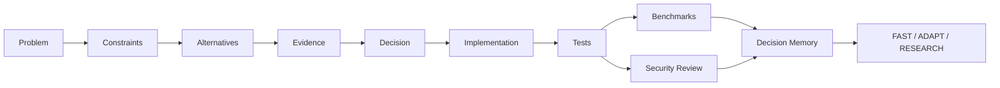
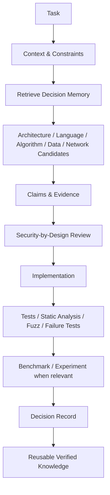

# ENGINEERING KNOWLEDGE

### Evidence-Driven Software Engineering Knowledge Base

> A human-readable and agent-readable engineering memory for choosing reliable, secure and efficient solutions from evidence rather than intuition alone.

This repository is the staging home for the future **`engineering-knowledge`** knowledge base. It is designed for both engineers and autonomous agents working across **Python, Go and C++**, algorithms, architecture, data, networking, reliability, testing, performance, DevSecOps and application security.

## Core principle

The goal is **not the most obvious or commonly accepted solution**. The goal is the **smallest reliable solution that satisfies the actual constraints**: sufficiently fast, secure, resilient, maintainable and explainable, with explicit trade-offs and verifiable evidence.

If a less obvious approach is better supported by research, official documentation, standards or reproducible experiments, the agent should prefer it and explain why it is more appropriate than the conventional alternative.

Every important engineering choice should be traceable through:

`Problem → Context → Constraints → Alternatives → Evidence → Decision → Implementation → Tests → Security Review → Measurement → Decision Memory`

## Knowledge domains

- [**Languages**](languages/README.md) — Python, Go, C++ and cross-language selection.
- [**Algorithms & Data Structures**](algorithms/README.md) — selection rules, complexity, alternatives and implementations.
- [**Architecture**](architecture/README.md) — topology, decomposition, ADRs and system boundaries.
- [**Databases**](databases/README.md) — data models, consistency, transactions, indexing and recovery.
- [**Networking**](networking/README.md) — protocols, trust boundaries, retries, timeouts and transport behaviour.
- [**Testing & Verification**](testing/README.md) — correctness, regression, fuzzing, static analysis and failure tests.
- [**Performance**](performance/README.md) — measurement-driven optimization and workload-specific benchmarking.
- [**Reliability**](reliability/README.md) — failure models, graceful degradation, recovery and resilience.
- [**DevSecOps**](devsecops/README.md) & [**Application Security**](application-security/README.md) — secure defaults, dependency risk, CI/CD controls and attack surface reduction.
- **Problems** — structured problem sets with multiple candidate solutions.
- **Sources & Claims** — standards, official documentation, books, papers, claims, contradictions and applicability.
- [**Decision Memory**](decision-memory/README.md) — verified reusable experience for FAST / ADAPT / RESEARCH paths.

## Knowledge object model

## System-level decision flow

Machine-readable policies live in `.ai/`, including retrieval, language selection, evidence, security-by-design and system-level decision policies.

## Evidence levels

Preferred evidence order:

1. **Primary specifications and official documentation** — language specs, standards, RFCs, official releases.
2. **Peer-reviewed research and recognized academic work**.
3. **Authoritative books and conference material**.
4. **Vendor engineering documentation and reproducible technical reports**.
5. **Independent benchmarks and engineering articles**.
6. **Community sources** only as hypotheses or supporting context, not as sole authority for critical decisions.

Evidence must record provenance, date/version and applicability.

## Decision quality

Candidates may be assessed across correctness, reliability, security, performance, memory use, maintainability, complexity, portability, testability, observability, operational cost and dependency risk.

A score is never enough by itself. Every score must be labeled as **MEASURED**, **DOCUMENTED**, **DERIVED**, **EXPERT_ESTIMATE** or **UNKNOWN**.

## For humans and agents

**Human interface:** concise README pages, diagrams, examples, comparisons, references and problem walkthroughs.

**Agent interface:** structured YAML metadata, stable IDs, relationship graphs, evidence records, selection rules, version/applicability fields and confidence/provenance.

## Portfolio navigation

← [Viktor Kulichenko Engineering Portfolio](https://github.com/VictorKVS/VictorKVS)

Related systems: [MindForge](https://github.com/VictorKVS/MindForge) · [SecGraph](https://github.com/VictorKVS/SecGraph) · [AI Neural Networks](https://github.com/VictorKVS/AI_Neural_Networks)

---

**Status:** active architecture and knowledge-engineering build
