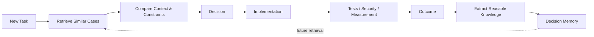

# Decision Memory

Decision Memory stores reusable engineering experience from verified tasks.

It is not a dump of conversations, logs or generated code. Only information that can improve future engineering choices should be retained.

## Learning loop



## Retrieval paths

### FAST PATH
Use a previously verified decision when the current context and constraints are sufficiently equivalent.

### ADAPT PATH
Retrieve one or more similar decisions, compare differences, then adapt the most reliable candidate.

### RESEARCH PATH
When evidence is insufficient or prior cases do not apply, research primary sources, run experiments and create a new verified decision.

## What may be learned

Retain reusable items such as:

- a stronger selection rule;
- a newly discovered constraint;
- a counterexample to an existing rule;
- a benchmark relevant to a defined workload;
- a security failure mode;
- a dependency or version caveat;
- a test pattern that exposes incorrect behaviour;
- an operational outcome that changes future recommendations.

Do **not** retain noise simply because it was present in the task.

## Required post-decision question

> What from this decision is reusable for a future engineer or agent?

If the answer is "nothing verified", no new reusable rule should be created.

## Rule evolution

Selection rules may be refined by verified evidence. Previous rules are not silently overwritten: changes should record provenance, reason and superseded versions.

Example:

```yaml
previous_rule:
  prefer: dijkstra
  when: weighted_graph

updated_rule:
  prefer: dijkstra
  when:
    - weighted_graph
    - non_negative_edges

change_reason:
  type: correctness_refinement
  evidence: documented
```

## Safety against institutional folklore

Decision memory must never become "we always do it this way" memory. Every reused decision remains conditional on its original context, constraints, versions and evidence.

← [Engineering Knowledge](../README.md)
