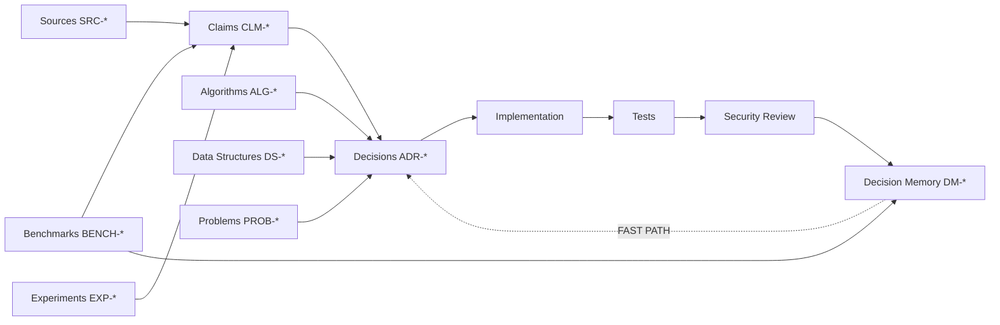

# Evidence Architecture

Engineering Knowledge separates **documents**, **claims**, **decisions** and **experience** so that agents can retrieve quickly without losing provenance.



## Why claims are separate from sources

A book, standard or paper can contain hundreds of statements and may only apply to certain versions or conditions. Agents should not repeatedly ingest a whole document when a reviewed, scoped claim already captures the relevant engineering fact.

The source remains linked so the agent can reconstruct the basis, inspect methodology or resolve disagreement.

## Fast retrieval

```text
Task
 ↓
DM: similar verified decisions?
 ↓ yes
CLM: do the relevant claims still apply?
 ↓ yes
Constraint / version / security check
 ↓
Reuse or adapt
```

Only when applicability is uncertain does the agent descend to raw sources, experiments and new benchmarks.

## Conflict handling

```text
CLM-0041
 ├─ supported by SRC-0012
 ├─ supported by BENCH-0031
 └─ contradicted by SRC-0048
```

The contradiction is retained. The agent compares scope, versions, methodology and workload before choosing whether the conflict is material to the current task.

## Learning loop

```text
new task
 → evidence retrieval
 → decision
 → implementation
 → tests
 → security review
 → measurement
 → outcome
 → reusable lesson
 → DM / CLM update
```

The system should learn from every **verified** decision, not from every generated answer.

## Promotion principle

No statement becomes FAST PATH merely because it was used successfully once. Promotion depends on the claimed scope and should require enough correctness, security, measurement, provenance and freshness evidence for that scope.

← [Engineering Knowledge](../README.md) · [Sources](../sources/README.md) · [Claims](../claims/README.md)
