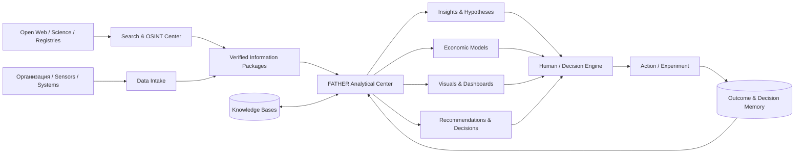
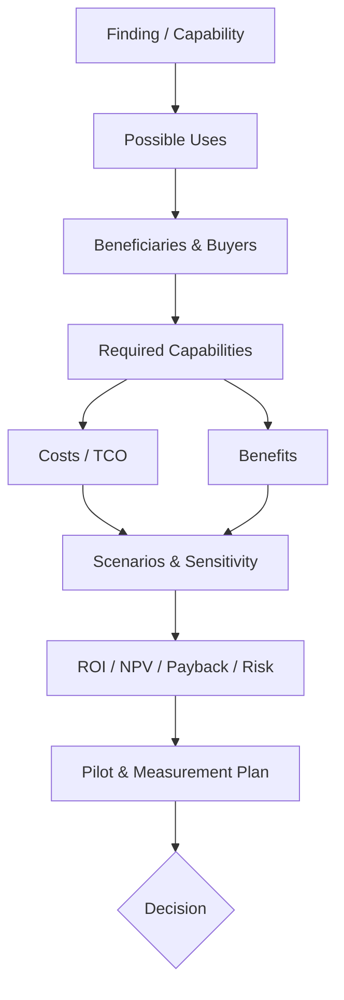
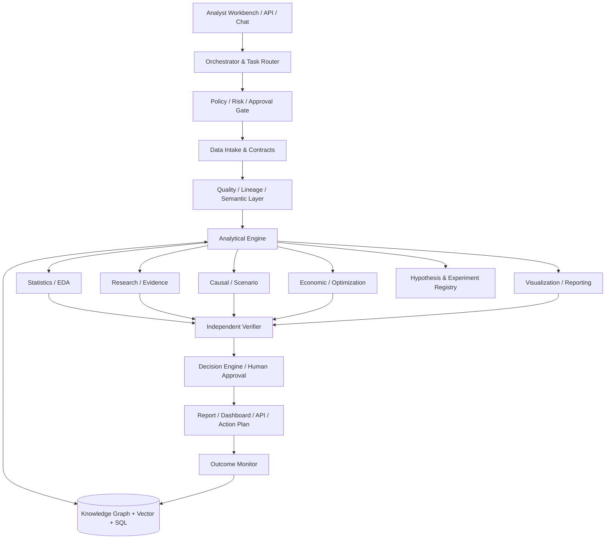
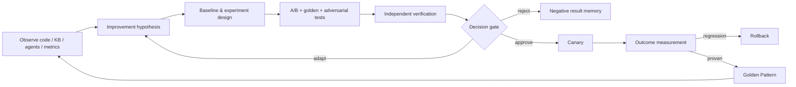

# FATHER Analytical Center

**Product ID:** `FATHER-AC-0001`  
**Тип:** самостоятельный аналитический продукт и мыслительный контур FATHER  
**Статус:** `M0 — SYSTEM DESIGN`  
**Связь:** Search & OSINT Center добывает и проверяет информацию; Analytical Center превращает её в решения и ценность.

## 1. Назначение

FATHER Analytical Center автоматизирует основную рутину профессионального аналитика после получения любых данных:

- понимает задачу и требуемое решение;
- оценивает пригодность и пробелы данных;
- объединяет документы, таблицы, графы, события, показатели и экспертные оценки;
- отделяет факт, вывод, гипотезу и рекомендацию;
- обнаруживает связи, тенденции, аномалии, причины, риски и возможности;
- формирует и проверяет исследовательские вопросы;
- строит сценарии, прогнозы и варианты действий;
- оценивает экономический эффект, затраты, TCO/ROI/NPV и чувствительность;
- предлагает способы полезного и коммерческого применения;
- создаёт выборки, графики, схемы, дашборды и доказательные отчёты;
- сохраняет результат в базы знаний и Decision Memory.

Цель — не заменить ответственность человека, а снять механическую работу, повысить полноту анализа и сделать путь от данных до решения воспроизводимым.

## 2. Место в FATHER



Метафора системы:

- Search/OSINT — органы чувств;
- Data Platform — кровеносная система;
- Knowledge Bases — память;
- Analytical Center — мышление;
- Decision Engine — воля и правила принятия решения;
- Agent Factory — производство исполнителей;
- LLM Security — иммунная система;
- человек — владелец цели, риска и окончательного решения.

## 3. Полный аналитический цикл

```
QUESTION / DECISION
→ CONTEXT & STAKEHOLDERS
→ DATA INVENTORY
→ QUALITY / BIAS / SECURITY GATE
→ DESCRIPTIVE ANALYSIS
→ DIAGNOSTIC ANALYSIS
→ HYPOTHESES
→ RESEARCH / EXPERIMENT DESIGN
→ PREDICTIVE / CAUSAL / SCENARIO ANALYSIS
→ ECONOMIC & RISK MODEL
→ OPTIONS & TRADE-OFFS
→ VISUAL STORY
→ INDEPENDENT VERIFICATION
→ HUMAN DECISION
→ ACTION
→ OUTCOME MEASUREMENT
→ KNOWLEDGE & DECISION MEMORY
```

Этот цикл согласуется с риск-ориентированным принципом `GOVERN → MAP → MEASURE → MANAGE`: цель и ответственность задаются до автоматизации, измерение предшествует управленческому решению.

## 4. Входной контракт

```yaml
analysis_task_id: AC-TASK-*
decision_to_support:
business_question:
research_questions: []
stakeholders: []
domain:
time_horizon:
jurisdiction:
inputs:
  documents: []
  datasets: []
  events: []
  graphs: []
  expert_statements: []
knowledge_bases: []
known_constraints: []
unknowns: []
risk_class:
economic_scope:
required_outputs: []
quality_thresholds: {}
human_approval_points: []
budget:
deadline:
```

Любая поступившая информация получает:

- источник, owner, время и версию;
- правовой режим и классификацию;
- способ получения;
- качество, полноту и возможное смещение;
- единицы измерения и семантику полей;
- допустимые способы объединения и использования;
- срок актуальности.

## 5. Типы анализа

| Контур | Вопрос | Методы | Результат |
|---|---|---|---|
| Descriptive | Что произошло? | профилирование, агрегация, распределения | факты и показатели |
| Diagnostic | Почему? | drill-down, Pareto, Ishikawa, 5 Why, граф связей | возможные причины |
| Comparative | Что отличается? | cohorts, benchmark, A/B, нормализация | различия и trade-offs |
| Temporal | Как менялось? | ряды, change points, сезонность | тенденции и события |
| Predictive | Что вероятно произойдёт? | статистика/ML, интервалы | прогноз с неопределённостью |
| Causal | Что действительно влияет? | DAG, эксперименты, quasi-experiments | причинная гипотеза/эффект |
| Prescriptive | Что делать? | оптимизация, MCDA, ограничения | ранжированные действия |
| Scenario | Что если? | сценарии, Monte Carlo, stress test | диапазон исходов |
| Risk | Что может пойти не так? | Bow-Tie, FMEA, threat modeling | риск и меры |
| Economic | Стоит ли это делать? | TCO, ROI, NPV, payback, sensitivity | финансовая модель |
| Research | Чего мы не знаем? | literature review, hypothesis/eval design | программа проверки |
| Opportunity | Как применить с выгодой? | value chain, capability mapping | use cases и бизнес-модель |

Критическое правило: корреляция не маркируется как причинность; прогноз не маркируется как факт; экспертная оценка не маскируется под измерение.

## 6. Выходной аналитический пакет

```yaml
analysis_id:
executive_summary:
facts: []
derived_findings: []
hypotheses: []
conflicts: []
unknowns: []
opportunities: []
use_cases: []
options:
  - option:
    benefits:
    costs:
    risks:
    dependencies:
    evidence:
economic_model:
recommended_actions: []
experiments: []
visual_assets: []
knowledge_nodes_created: []
confidence:
limitations: []
reviewers: []
decision_status:
recheck_at:
```

Каждый тезис получает тип:

- `OBSERVED` — непосредственно в данных;
- `DOCUMENTED` — подтверждён источником;
- `CALCULATED` — получен воспроизводимым расчётом;
- `INFERRED` — логический/статистический вывод;
- `EXPERT_ESTIMATE` — экспертная оценка;
- `HYPOTHESIS` — требует проверки;
- `UNKNOWN` — данных недостаточно.

## 7. Экономический аналитик

Для каждой возможности центр отвечает:

1. какую пользу она создаёт;
2. кто получает ценность и кто платит;
3. какой процесс и ресурс она заменяет или усиливает;
4. что требуется для внедрения;
5. CAPEX, OPEX, TCO и стоимость миграции;
6. базовый, оптимистичный и стресс-сценарий;
7. ROI, payback и при необходимости NPV/IRR;
8. чувствительность к ключевым допущениям;
9. альтернативная стоимость;
10. риски, ограничения и критерии остановки;
11. какие данные подтвердят фактическую выгоду после запуска.



Модель хранит формулы, единицы, валюту, период, источники чисел и диапазоны. Неизвестное не заменяется нулём.

## 8. Визуальная аналитика

Центр автоматически выбирает форму, соответствующую вопросу:

- KPI/scorecard — состояние;
- line/change-point — динамика;
- bar/dot plot — сравнение;
- histogram/box plot — распределение;
- scatter — взаимосвязь;
- cohort/funnel — прохождение процесса;
- map — география;
- graph — сущности и связи;
- timeline — события;
- Sankey — потоки;
- heatmap/matrix — покрытие и риски;
- Bow-Tie — причины, барьеры и последствия;
- scenario fan / tornado — неопределённость и чувствительность;
- dashboard — наблюдение;
- analytical brief — решение.

Правила: один граф — один вопрос; оси и единицы обязательны; масштабы не искажают вывод; показываются источник, период, фильтры, размер выборки и неопределённость; декоративная красота не имеет приоритета над достоверностью.

## 9. Формирование исследовательских вопросов

Из каждой информации центр извлекает:

- что утверждается;
- на каких условиях;
- что отсутствует;
- какие объяснения конкурируют;
- что можно опровергнуть;
- какие данные разделят альтернативы;
- какой минимальный эксперимент даст решение;
- какой потенциальный эффект оправдывает исследование.

```
НАБЛЮДЕНИЕ
→ НЕОБЫЧНОСТЬ / ПРОБЕЛ / КОНФЛИКТ
→ ВОПРОС
→ ГИПОТЕЗЫ
→ ПРЕДСКАЗАНИЯ
→ ДАННЫЕ / ЭКСПЕРИМЕНТ
→ КРИТЕРИЙ ОПРОВЕРЖЕНИЯ
→ РЕЗУЛЬТАТ
→ НОВОЕ ЗНАНИЕ
```

## 10. Senior Competency Model

Аналитический центр проектируется как команда, а не один prompt.

| Роль/компетенция | Обязательные навыки |
|---|---|
| Lead/Business Analyst | problem framing, stakeholders, requirements, BPMN/DMN, acceptance |
| Data Analyst | SQL, statistics, data quality, EDA, reproducible notebooks |
| BI Analyst | semantic model, KPI, dashboards, visual perception, storytelling |
| Research Analyst | reviews, evidence grading, hypotheses, experiment design |
| OSINT Analyst | collection planning, source evaluation, corroboration, entity resolution |
| Systems Analyst | boundaries, interfaces, state/data models, NFR |
| Knowledge Engineer | ontology, stable IDs, provenance, graph/RAG, conflict/version handling |
| Decision/Risk Analyst | MCDA, scenarios, uncertainty, Bow-Tie/FMEA |
| Economic/Financial Analyst | unit economics, TCO, ROI, NPV, sensitivity |
| ML/Quant Analyst | forecasting, validation, drift, causal limitations |
| Security/Privacy Analyst | threat modeling, access, privacy, supply chain, audit |
| Visualization Specialist | chart choice, information design, accessibility |
| Domain Expert | отраслевые правила, реалистичность и профессиональный review |
| Verification Lead | independent reproduction, challenge, red-team, sign-off |

Для каждого навыка создаются: competency level, checklist, methods library, golden cases, anti-patterns, tests и production evidence.

## 11. Архитектура



### Технологические слои

- ingestion: connectors, files, APIs, events;
- storage: object store + PostgreSQL + pgvector + graph projection;
- transformations: versioned SQL/Python pipelines;
- semantic layer: glossary, measures, entity master;
- analytics: statistics, ML, causal/scenario and optimization modules;
- orchestration: stateful durable workflows;
- presentation: dashboards, reports, diagrams, Q&A;
- control: IAM, policy engine, secrets, sandbox, audit and observability;
- registries: data, models, experiments, hypotheses, decisions and visuals.

## 12. Безопасность и надёжность

Основные угрозы:

- poisoned или подменённые данные;
- prompt injection внутри документов;
- ошибочное объединение одноимённых сущностей;
- утечки ПДн, коммерческой и иной охраняемой информации;
- статистическая ошибка, p-hacking и cherry-picking;
- выдуманные ссылки, числа и причинность;
- leakage между train/test и проектами;
- model/data drift;
- автоматическое действие по непроверенному выводу;
- манипулятивная визуализация;
- финансовая модель со скрытыми допущениями.

Контроли:

- data contracts, lineage, hashes и immutable snapshots;
- RBAC/ABAC, purpose limitation и least privilege;
- quarantine и content disarm;
- вычисления в sandbox;
- versioned code/formulas/datasets;
- независимый verifier;
- confidence/uncertainty и explicit unknown;
- reproducible run;
- segregation of duties;
- human approval для high-risk;
- audit trail и rollback;
- мониторинг фактического результата.

Для AI-контура применяются функции NIST AI RMF: Govern, Map, Measure, Manage, а также testing, evaluation, verification and validation.

## 13. Что уже можно переиспользовать

Не начинаем с нуля:

- из Search & Analytics Center: карточка поиска, source/evidence gates, два потока;
- из OSINT_deepseek: provenance, bounded research loops, сбор и маршрутизация;
- из Security KB: SOURCE → CLAIM → REQUIREMENT → CONTROL → EVIDENCE;
- из KNOWLEDGE_CORE: Decision Memory, Golden Patterns и стабильные ID;
- из FATHER Core: оркестрация, роли, approvals, журнал и метрики;
- из Engineering Competency Lab: уровни навыков, обучающий режим и A/B;
- из Quant Lab: сценарии, временные ряды, backtest и экономические метрики;
- из будущего Regulatory Twin: impact analysis и what-if.

## 14. Контур самоанализа и совершенствования FATHER

Аналитический центр исследует саму экосистему как управляемый объект:

| Объект | Что измеряется | Возможные улучшения |
|---|---|---|
| Код | дефекты, сложность, coverage, duplication, performance, dependency risk | refactoring, алгоритм, язык, библиотека |
| Архитектура | coupling, latency, reliability, стоимость, security boundaries | decomposition, caching, contracts, topology |
| Базы знаний | coverage, freshness, conflicts, orphan nodes, retrieval quality | новые источники, ontology, chunking, links |
| Навыки агентов | task success, factuality, tool safety, cost, stability | prompt, tool, workflow, examples, fine-tuning |
| Методы аналитики | precision/recall, bias, reproducibility, usefulness | новый метод, комбинация, критерий |
| Инфраструктура | uptime, compute, storage, queue, energy/cost | scaling, scheduling, model routing |
| Продукты | adoption, outcome, defects, value, TCO/ROI | feature, simplification, pricing, retirement |



### Карточка улучшения

```yaml
improvement_id: FATHER-IMP-*
target_type: code|architecture|knowledge|skill|agent|workflow|infrastructure
baseline_version:
problem_evidence: []
hypothesis:
proposed_change:
expected_effect:
metrics:
guardrails:
experiment_design:
test_sets: [golden, regression, adversarial]
cost_limit:
risk_class:
verifier:
human_approval:
canary_scope:
rollback:
result:
decision:
knowledge_nodes: []
```

### Неподлежащие нарушению правила

- аналитик предлагает изменение, но не утверждает собственный результат;
- production-код, веса, права и базы не изменяются без отдельного gate;
- A/B выполняется на сопоставимых входах и фиксированных версиях;
- success metric дополняется guardrail-метриками безопасности, стоимости и регрессий;
- отрицательный результат сохраняется;
- улучшение сначала проходит sandbox, затем canary;
- всегда определён rollback;
- подтверждённое улучшение становится Golden Pattern только после воспроизведения;
- самоизменение без аудита и human approval запрещено.

## 15. Уровни зрелости

| Этап | Состав | Проверка |
|---|---|---|
| M0 — Formalized Analyst | taxonomy, contracts, роли, методы, архитектура | 10 ручных эталонных кейсов |
| M1 — Analytical Workbench | документы + CSV/XLSX, EDA, выводы, графики, report | 3 домена, воспроизводимый run |
| M2 — Multi-Agent Analysis | specialist agents + verifier + KB write-back | golden/adversarial eval |
| M3 — Decision Intelligence | сценарии, экономика, оптимизация, dashboards | решение → action → outcome |
| M4 — Analytical Factory | очереди проектов, шаблоны отраслей, SLA, monitoring | пилоты с измеренной выгодой |
| M5 — Senior Virtual Center | полный competency coverage и continuous improvement | независимый аудит и production evidence |

## 16. Первый MVP

Три сквозных кейса:

1. **152-ФЗ:** вход — профиль организации и нормативные источники; выход — применимость, обязанности, доказательства, риски, стоимость устранения и roadmap.
2. **OSINT:** вход — пакет сущностей/событий; выход — граф, хронология, гипотезы, corroboration, риски и следующие поисковые задачи.
3. **Проект/технология:** вход — описание идеи и доступные данные; выход — use cases, необходимые capabilities, архитектурные варианты, TCO/ROI-сценарии, риски, пилот и метрики успеха.

M1 не обучает собственную модель. Он использует RAG, tools, шаблоны, проверяемые расчёты и human approval. Данные для SFT/RL появятся как побочный продукт качественно выполненных и проверенных кейсов.

## 17. Критерий хорошего результата

Хороший анализ:

- отвечает на решение, а не пересказывает данные;
- отделяет факт от вывода;
- показывает альтернативы и неизвестное;
- воспроизводится из сохранённых входов и кода;
- содержит красивую, но честную визуализацию;
- объясняет пользу, затраты, риск и необходимые условия;
- предлагает минимальную проверку;
- связан с источниками и базами знаний;
- измеряется после применения;
- улучшает следующий анализ.
