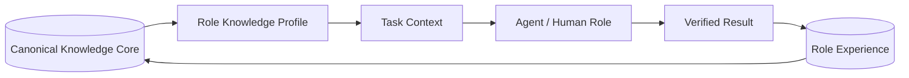

# FATHER Role Knowledge System

**System ID:** `FATHER-RKS-0001`  
**Назначение:** персональные профили знаний, навыков, инструментов, ограничений и опыта для всех ролей FATHER.

## 1. Архитектурный принцип

У роли нет изолированной копии общей базы. Есть единое каноническое доказательное ядро и управляемая ролевая проекция.



Это обеспечивает:

- отсутствие дублирования документов;
- единое обновление законов, стандартов и методов;
- минимально необходимые права;
- специализированный словарь и retrieval;
- собственные методы, инструменты и тесты роли;
- перенос подтверждённого опыта между продуктами;
- раздельную оценку компетентности.

## 2. Паспорт роли

```yaml
role_id: FATHER-ROLE-*
title:
mission:
product_owner:
responsibilities: []
non_responsibilities: []
decision_rights: []
knowledge_profile:
  required_domains: []
  optional_domains: []
  prohibited_domains: []
  source_classes: []
  retrieval_policy:
competencies: []
methods: []
tools: []
input_contracts: []
output_contracts: []
quality_metrics: []
risk_metrics: []
golden_cases: []
adversarial_cases: []
handoffs: []
human_approval: []
maturity_level: L0
verified_experience: []
known_limits: []
recheck_at:
```

## 3. Слои зрелости знаний роли

| Уровень | Содержание | Способ проверки | Право роли |
|---|---|---|---|
| L0 — Identity | миссия, обязанности, границы, словарь | role contract review | только объяснять |
| L1 — Foundation | основные источники, понятия, чек-листы | тест знаний + простые кейсы | работать по шаблону |
| L2 — Practitioner | методы, tools, типовые сценарии | 3 рабочих кейса | выполнять стандартные задачи |
| L3 — Senior | trade-offs, исключения, риски, интеграции | сложные и adversarial cases | выбирать и обосновывать |
| L4 — Lead | проектирование систем, review, экономика | междоменный проект | утверждать в пределах допуска |
| L5 — Research/Architect | новые методы, эксперименты, Golden Patterns | независимое воспроизведение | предлагать стандарты развития |

Зрелость присваивается отдельно по компетенциям. Роль может иметь L4 в одном домене и L1 в другом.

## 4. Виртуальный штат FATHER

### Управление и знания

| Role ID | Роль | Личная проекция знаний | Основные результаты |
|---|---|---|---|
| ROLE-GOV-001 | Product Owner | стратегия, пользователи, value, roadmap | приоритеты и product gates |
| ROLE-LIB-001 | Chief Librarian | источники, лицензии, версии, lifecycle | реестр библиотек |
| ROLE-KG-001 | Knowledge Engineer | ontology, graph, provenance, RAG | связанные узлы и retrieval |
| ROLE-VER-001 | Independent Verifier | evidence grading, reproduction, challenge | approve/reject/conditions |
| ROLE-DOM-001 | Domain Expert | отраслевые нормы и практика | professional sign-off |

### Поиск и аналитика

| Role ID | Роль | Личная проекция знаний | Основные результаты |
|---|---|---|---|
| ROLE-SRC-001 | Source Scout | каталоги, поисковые стратегии, source maps | кандидаты источников |
| ROLE-OSINT-001 | OSINT Analyst | collection, corroboration, entities, timelines | verified OSINT package |
| ROLE-RES-001 | Research Analyst | reviews, hypotheses, experiments | research brief |
| ROLE-DATA-001 | Data Analyst | SQL, statistics, EDA, quality | reproducible findings |
| ROLE-BI-001 | BI Analyst | semantic model, KPI, visual grammar | dashboard/report |
| ROLE-ECO-001 | Economic Analyst | TCO, ROI, NPV, unit economics | economic model |
| ROLE-RISK-001 | Decision/Risk Analyst | MCDA, scenario, Bow-Tie/FMEA | options and risk model |
| ROLE-CAUS-001 | Causal/Quant Analyst | experiments, forecasting, uncertainty | effect/scenario estimate |

### Инженерия и выпуск

| Role ID | Роль | Личная проекция знаний | Основные результаты |
|---|---|---|---|
| ROLE-ARCH-001 | System Architect | boundaries, NFR, patterns, ADR | target architecture |
| ROLE-SA-001 | System Analyst | requirements, contracts, BPMN/DMN | formal specification |
| ROLE-DEV-001 | Software Engineer | languages, algorithms, secure coding | implementation |
| ROLE-TEST-001 | Test/Eval Engineer | test design, golden/adversarial/fuzz | verification evidence |
| ROLE-DEVOPS-001 | Platform/DevOps | CI/CD, runtime, observability, recovery | reproducible operation |
| ROLE-SEC-001 | Security/Privacy Reviewer | threats, IAM, privacy, supply chain | security gate |
| ROLE-AI-001 | Agent/ML Engineer | models, RAG, tools, training, eval | agent/model version |
| ROLE-REL-001 | Release Manager | versions, canary, rollback, SLO | controlled release |
| ROLE-MON-001 | Monitoring Analyst | quality, drift, cost, incidents | operational feedback |

## 5. Состав личной базы роли

Каждая проекция содержит семь разделов:

| Раздел | Содержание |
|---|---|
| KNOW | термины, факты, стандарты, источники |
| DO | методы, алгоритмы, SOP, checklists |
| USE | разрешённые tools, models, datasets |
| DECIDE | decision tables, thresholds, escalation |
| PROVE | golden cases, tests, evidence requirements |
| AVOID | anti-patterns, failures, prohibited actions |
| LEARN | verified experience, A/B results, improvement backlog |

## 6. Связи

```
ROLE
→ REQUIRES COMPETENCY
→ READS KNOWLEDGE DOMAIN
→ USES METHOD / TOOL
→ PRODUCES ARTIFACT
→ HANDS OFF TO ROLE
→ PASSES GATE
→ RECEIVES OUTCOME
→ EARNS VERIFIED EXPERIENCE
```

Знание связывается с ролью через `ROLE_REQUIRES_KNOWLEDGE`, но оригинальный узел остаётся в канонической базе.

## 7. Метрики роли

### Качество

- task success;
- factual/citation correctness;
- completeness;
- reproducibility;
- applicability;
- defect escape rate;
- verifier disagreement.

### Производство

- throughput;
- cycle time;
- time-to-first-useful-result;
- rework;
- cost per verified outcome;
- tool/model consumption.

### Безопасность

- policy violations;
- unsafe tool attempts;
- secret/PII exposure;
- unapproved actions;
- prompt-injection resistance;
- rollback readiness.

### Развитие

- competency coverage;
- golden cases passed;
- retained improvements;
- regression rate;
- knowledge freshness;
- useful negative results.

## 8. Обучение и повышение зрелости

```
ASSESS GAP
→ ASSIGN SOURCE PACK
→ STUDY / RAG
→ GUIDED CASE
→ INDEPENDENT CASE
→ GOLDEN TEST
→ ADVERSARIAL TEST
→ VERIFIER REVIEW
→ PROMOTE COMPETENCY
→ MONITOR PRODUCTION
```

До обучения весов применяются role profile, RAG, tools и verified examples. SFT/PEFT рассматривается после накопления стабильных примеров. RL — только при измеримой среде, надёжном reward и защищённом rollback.

## 9. Управление изменениями

1. Chief Librarian обновляет источник.
2. Knowledge Engineer создаёт/обновляет канонические узлы.
3. Impact Analysis определяет затронутые роли, skills, tests и products.
4. Владельцам ролей создаются change tasks.
5. Ролевые retrieval-профили и checklists обновляются.
6. Выполняются регрессионные тесты.
7. Verifier подтверждает изменение.
8. Новая версия профиля выпускается через canary.
9. Старая версия сохраняется для rollback и аудита.

## 10. RACI

| Действие | Role Owner | Chief Librarian | Knowledge Engineer | Security | Verifier | Product Owner |
|---|---|---|---|---|---|---|
| определить обязанности | R | C | C | C | C | A |
| выбрать источники | C | A/R | C | C | C | I |
| построить проекцию | C | C | A/R | C | C | I |
| допустить tool/model | C | I | C | A/R | C | A |
| повысить зрелость | R | C | C | C | A | I |
| изменить production-права | C | I | I | R | C | A |
| отозвать профиль | R | C | C | R | C | A |

## 11. Первая волна заполнения

### P0

1. Chief Librarian;
2. Knowledge Engineer;
3. Search/OSINT Analyst;
4. Research Analyst;
5. Independent Verifier;
6. Security/Privacy Reviewer;
7. Data/BI Analyst;
8. Economic Analyst;
9. System Architect;
10. Agent/ML Engineer.

### Порядок

- сначала L0 для всех P0-ролей;
- затем L1 для всех — общий словарь и культура;
- затем L2 по первому сквозному кейсу 152-ФЗ;
- L3 только после независимых сложных кейсов;
- L4/L5 не назначаются по описанию — только по evidence.

## 12. Acceptance gate

Роль готова к самостоятельной работе на уровне L2, если:

- паспорт и границы утверждены;
- все обязательные источники имеют provenance;
- вход/выход валидируются schema;
- пройдены 3 типовых и 2 отрицательных кейса;
- golden score соответствует порогу;
- нет Critical/High security findings;
- handoff воспроизводим;
- verifier подтвердил результат;
- определены escalation и rollback.
