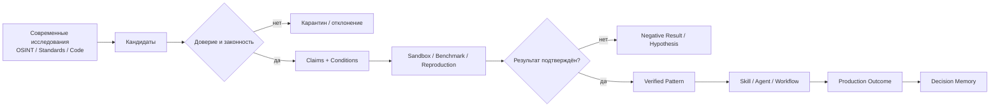
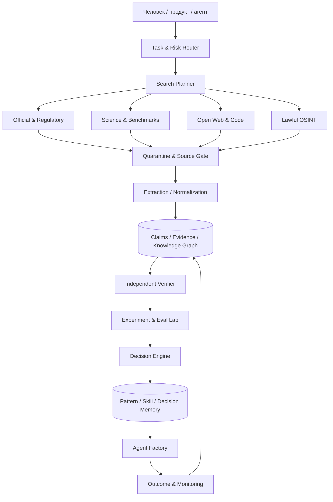
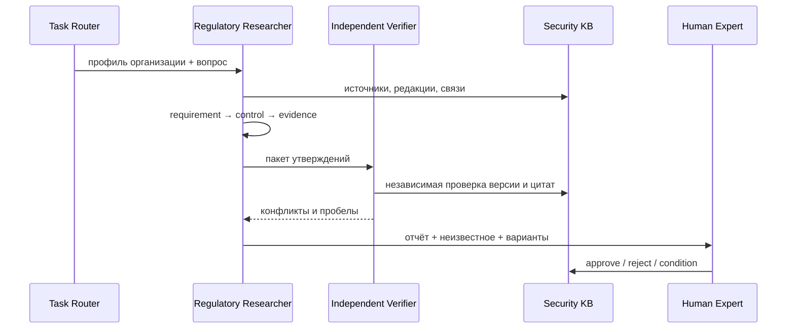

# FATHER Search & Analytics Center

**Product ID:** `FATHER-SAC-0001`  
**Тип:** самостоятельный продукт, интеллектуальное ядро и испытательный полигон FATHER  
**Статус:** `M0 — PRODUCT DEFINITION`  
**Первый домен:** информационная безопасность и нормативная база 152-ФЗ

## Идея продукта

FATHER Search & Analytics Center — поисково-аналитический центр, который отслеживает современные исследования, нормативные изменения, технологии, алгоритмы, библиотеки, угрозы и отраслевой опыт, а затем превращает найденное в доказательные, версионированные и повторно используемые знания.

Ценность создаёт не объём ссылок, а способность:

- быстро находить новые сигналы;
- отличать первоисточник от пересказа;
- проверять актуальность, законность и применимость;
- сравнивать не отдельные алгоритмы, а комбинации в заданной среде;
- воспроизводить результаты;
- сохранять успешные и отрицательные результаты;
- превращать проверенное знание в pattern, skill, agent и workflow.

## Позиционирование

Это одновременно:

1. **Search Intelligence Center** — системный поиск по Open Web, научным, нормативным и техническим источникам;
2. **OSINT Analysis Center** — законная разведка открытых источников с provenance и corroboration;
3. **Research Laboratory** — сравнение методов поиска, retrieval, моделей и аналитических цепочек;
4. **Knowledge Refinery** — очистка сырой информации и производство проверенных узлов;
5. **Decision Memory** — накопление Golden Patterns и границ их применимости;
6. **Agent Training Ground** — генерация воспроизводимых задач, эталонов и обратной связи;
7. **самостоятельный коммерческий продукт** — отраслевые исследования, мониторинг изменений, due diligence и аналитические отчёты.

## Главный принцип

> Передовые исследования отслеживаются непрерывно, но в рабочий контур проходят преимущественно устойчивые, надёжные и воспроизводимые решения, соответствующие конкретной задаче и среде.



## Регламент поискового задания

Каждое исследование начинается с карточки:

```yaml
search_task_id: SAC-TASK-*
question:
decision_to_support:
requester:
domain:
jurisdiction:
time_cutoff:
scope_in:
scope_out:
source_classes_allowed: []
languages: []
required_primary_sources:
minimum_independent_confirmations:
metrics:
risk_class:
legal_constraints: []
security_constraints: []
budget:
deadline:
human_approval:
deliverables: []
```

### Этапы

1. **Постановка:** вопрос преобразуется в проверяемое решение, границы и acceptance criteria.
2. **Декомпозиция:** сущности, синонимы, временные рамки, языки, юрисдикции и типы источников.
3. **Source map:** официальные, научные, отраслевые, инженерные, community и OSINT-каналы.
4. **Два потока:** Research Agent собирает кандидаты; Verification Agent независимо ищет подтверждения и опровержения.
5. **Извлечение:** claim, evidence, условия, показатели, ограничения, конфликт, лицензия и версия.
6. **Триангуляция:** первоисточник + независимое подтверждение + собственный эксперимент, если применимо.
7. **Сравнение:** baseline, альтернативы, комбинации, стоимость, latency, безопасность и failure modes.
8. **Решение:** verified, conditional, hypothesis, rejected или obsolete.
9. **Упаковка:** отчёт, граф узлов, pattern/skill, dataset/eval и список неизвестного.
10. **Контроль:** peer/expert review, approval, публикация, мониторинг изменений и дата повторной проверки.

## Архитектура центра



## Модель узлов

```
SEARCH_TASK → QUERY → SOURCE → SNAPSHOT → CHUNK → CLAIM → EVIDENCE
→ CONFLICT → EXPERIMENT → RESULT → VERIFIED_PATTERN
→ SKILL → AGENT_VERSION → WORKFLOW_RUN → OUTCOME
```

У каждого узла: стабильный ID, версия, provenance, owner, лицензия, confidence, maturity, applicability, risk, reviewer и `recheck_at`.

## Полигон методов поиска

Центр сравнивает:

- поисковые запросы и стратегии декомпозиции;
- источники и порядок их обхода;
- keyword, semantic, hybrid и graph retrieval;
- rerankers, embeddings, LLM и локальные модели;
- single-agent и multi-agent цепочки;
- глубину поиска и критерии остановки;
- способы удаления дублей и разрешения конфликтов;
- качество цитирования и прослеживаемость;
- стоимость, latency и вычислительные ресурсы.

### Метрики

| Группа | Метрики |
|---|---|
| Полнота | recall по golden set, coverage сущностей/источников |
| Точность | precision, factuality, citation correctness |
| Доказательность | доля primary sources, corroboration rate |
| Актуальность | version/date correctness, time-to-detection |
| Аналитика | conflict detection, applicability correctness |
| Экономика | стоимость задачи, человеко-часы, tokens/compute |
| Скорость | time-to-first-signal, time-to-verified-answer |
| Безопасность | poisoning, injection, secrets/PD leakage |
| Воспроизводимость | repeatability и variance между runs |

## Уровни зрелости продукта

| Этап | Результат | Приёмка |
|---|---|---|
| M0 — Регламент | паспорт, schema, роли, source/evidence gates | 10 эталонных карточек проходят вручную |
| M1 — Полигон | два потока, журнал, golden set, A/B поиск | 152-ФЗ vertical slice воспроизводим |
| M2 — Центр | несколько KB и domain routers | единый запрос собирает evidence из 3+ баз |
| M3 — Фабрика аналитики | команды агентов и мониторинг изменений | impact analysis и регрессия автоматизированы |
| M4 — Продукт | UI/API, проекты, защищённые пространства | пилот клиента с SLA и аудитом |
| M5 — Сеть центров | отраслевые узлы и federation | перенос patterns с проверкой применимости |

## Первый пример: 152-ФЗ

**Вопрос:** какие обязанности возникают у конкретного оператора ПДн и чем подтверждается их исполнение?



Эталонный результат содержит действующую редакцию и дату, дословный locator, атомарные требования, применимость, ответственных, сроки, контроли, проверки, доказательства, связанные нормы, риски ошибки и неизвестное.

## Производственные роли

- Product Owner;
- Search/OSINT Analyst;
- Source Scout;
- Research Agent;
- Regulatory/Domain Expert;
- Knowledge Engineer;
- Verification Agent;
- Experiment Designer;
- Red Team / Safety Reviewer;
- Release Manager;
- Monitoring Agent.

## Безопасность

Обязательны quarantine, sandbox, allowlist источников и tools, защита от prompt injection, malware/secret/PII check, SBOM для кода, неизменяемые снимки, signed artifacts, least privilege, журнал решений и human approval для критических выводов. Dark-web-контур допускает только законную работу с индикаторами и метаданными по отдельной процедуре.

## Варианты продукта

- Regulatory Intelligence;
- Security & Threat Intelligence;
- Technology Radar;
- Scientific Evidence Center;
- Vendor/Product Due Diligence;
- Competitive/Market Intelligence;
- Architecture Decision Research;
- Healthcare Evidence Center;
- персональный Research Copilot;
- API проверенных claims, patterns и evidence packs.

## Связанные документы

- [Knowledge acquisition and Agent Factory](./FATHER_KNOWLEDGE_ACQUISITION_AND_AGENT_FACTORY_PLAN.md)
- [FATHER Library Registry](./FATHER_LIBRARY_REGISTRY.md)
- [FATHER Modular Product Plan](./FATHER_MODULAR_PRODUCT_PLAN.md)
- [Security Knowledge Base](../security-knowledge/README.md)
