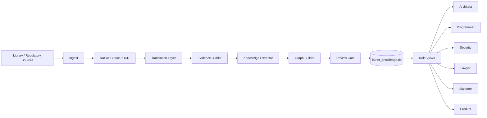
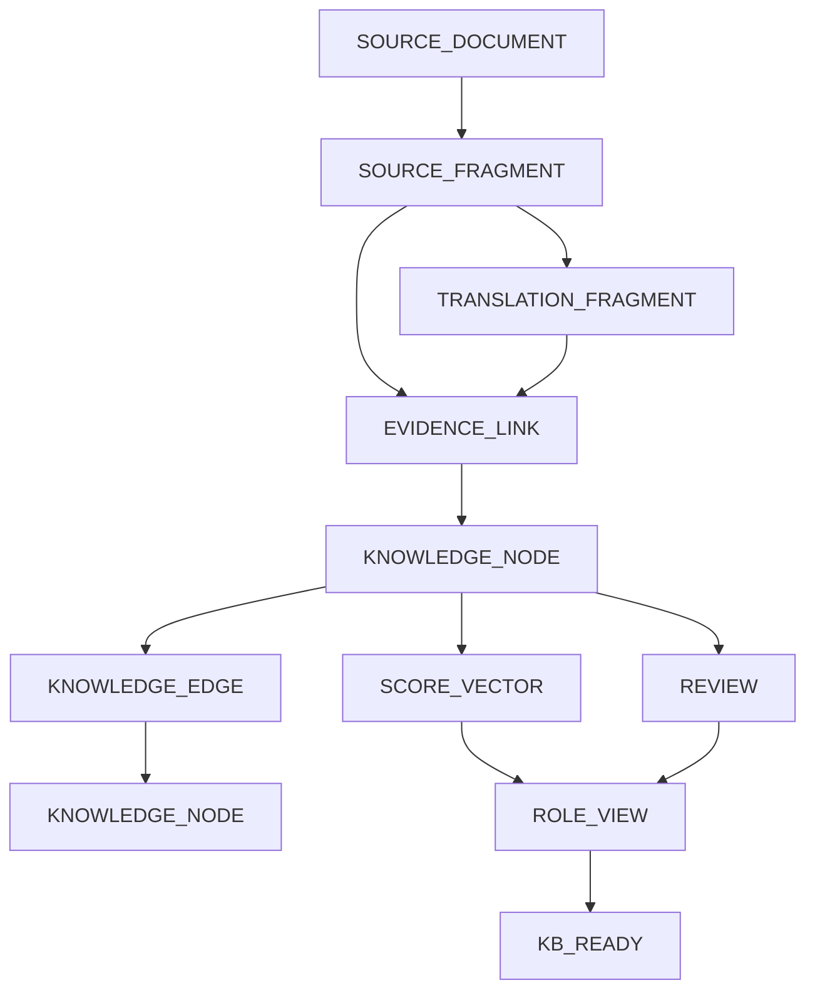

# FATHER Knowledge Factory M1 — Архитектура и связи

## C4-like component view

## Data lineage

## Relationship rules

### Document -> Fragment
One-to-many. Fragment locator is structured: page, section, block, bbox, ordinal. Fragment SHA-256 is calculated on the original fragment payload.

### Fragment -> Translation
One-to-many by translation revision. Original fragment is immutable. Translation carries source fragment ID, model, prompt/profile revision, glossary revision and reviewer.

### Fragment -> Node
Many-to-many through `evidence_links`. One source fragment may support several atomic nodes; one node may be supported by several independent sources.

### Node -> Node
Many-to-many through `knowledge_edges`. Edge is a first-class object with type, provenance, confidence components and lifecycle status.

### Node -> Review
One-to-many append-only history. A new review never destroys an old review.

### Node -> Role
Many-to-many through `role_views`. Role view changes prioritization/relevance, not semantic identity.

## ID convention

Logical IDs must remain stable after export/import:

- `DOC-<ulid/uuid>`
- `FRG-<ulid/uuid>`
- `TRN-<ulid/uuid>`
- `KN-<ulid/uuid>`
- `EDGE-<ulid/uuid>`
- `EVD-<ulid/uuid>`
- `REV-<ulid/uuid>`
- `RUN-<ulid/uuid>`

M1 implementation may use UUIDv4 strings; semantic deduplication must not depend on rowid.

## Node identity and dedup

Exact duplicate source bytes are detected by SHA-256. Semantic nodes are not merged solely by embeddings or LLM similarity. Candidate `SAME_AS` is created and promoted only after deterministic normalization plus review.

## Contradictions

A contradiction is preserved as relation `CONTRADICTS`, with evidence on both ends. The system must never silently choose one side. Resolution may depend on scope, date, jurisdiction, context or source authority.

## Processing boundaries

- Ingest may create documents/fragments only.
- Translator may create translations only.
- Knowledge extractor creates candidates, never KB_READY directly.
- Graph builder creates candidate edges.
- Review gate alone promotes candidate knowledge.
- Role views are projections over approved/candidate nodes and cannot rewrite evidence.

## Failure isolation

Each stage writes a machine-readable state and may resume idempotently. A failure in reviewer/model does not invalidate extracted evidence. Parallel workers must use transactions and unique constraints to avoid duplicate rows.

## Local/runtime boundary

`KNOWLEDGE_CORE` contains schemas, code, policies and safe fixtures. Local `G:\1\FATHER_KNOWLEDGE` contains copyrighted originals, extracted full text, translations, DB runtime, embeddings and reports.