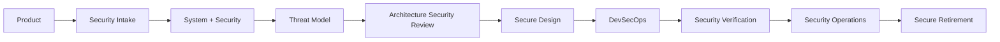

# L0 — FATHER Software Factory

Status: `CANDIDATE_MODEL`

This is the top-level business-process view. Details live in L1/L2 models.

```mermaid
flowchart LR
    S((START)) --> P[1. Product Discovery]
    P --> G1{PRODUCT_READY}
    G1 --> SI[2. Security Intake]
    SI --> G2{SECURITY_INTAKE_READY}
    G2 --> SE[3. System Engineering]
    SE --> G3{SYSTEM_MODEL_READY}
    G3 --> TM[4. Threat Model v0]
    TM --> G4{THREAT_MODEL_V0_READY}
    G4 --> RQ[5. Requirements Baseline]
    RQ --> G5{REQUIREMENTS_BASELINE_READY}
    G5 --> AO[6. Architecture Options]
    AO --> G6{ARCHITECTURE_OPTIONS_READY}
    G6 --> AD[7. Architecture Decision]
    AD --> G7{ARCHITECTURE_DECISION_READY}
    G7 --> DD[8. Detailed Design]
    DD --> G8{DESIGN_READY_FOR_IMPLEMENTATION}
    G8 --> IM[9. Implementation]
    IM --> G9{IMPLEMENTATION_BASELINE_READY}
    G9 --> VV[10. Verification & Validation]
    VV --> G10{RELEASE_CANDIDATE_READY}
    G10 --> RD[11. Release & Deployment]
    RD --> G11{PRODUCTION_READY}
    G11 --> OM[12. Operation & Maintenance]
    OM --> G12{OPERATION_CONTROLLED}
    G12 --> RT[13. Retirement]
    RT --> G13{RETIRED_VERIFIED}
    G13 --> E((END))

    G1 -. blocked .-> P
    G2 -. blocked .-> SI
    G3 -. blocked .-> SE
    G4 -. blocked .-> TM
    G5 -. blocked .-> RQ
    G6 -. blocked .-> AO
    G7 -. blocked .-> AD
    G8 -. blocked .-> DD
    G9 -. blocked .-> IM
    G10 -. blocked .-> VV
    G11 -. blocked .-> RD
    G12 -. feedback / change .-> P
```

## Constitutional overlay

Security is not a single box that disappears after stage 2. The top-level representation abbreviates a continuous lane:

## Factory rule

Every arrow between stages is an information/evidence hand-off. A downstream specialist receives canonical artifacts, not undocumented assumptions.

At every gate:

`required inputs + produced artifacts + review evidence + unresolved gaps + authority decision -> PASS / CONDITIONAL / BLOCKED`.
