# L1 — FATHER Software Factory Stage Decomposition

Status: `CANDIDATE_MODEL`

Each section is an L1 subprocess. The same structure is used everywhere: IDEF0 passport + BPMN-style visual projection.

---

## 1. PRODUCT_DISCOVERY

**Input:** business need, sponsor context.  
**Control:** FATHER Constitution, portfolio/product policy.  
**Mechanism:** Product Manager, Business Owner, BA, PM, Knowledge Growth Analyst.  
**Output:** Product Vision, Business Need, Success Metrics, Stakeholder Register, Scope Baseline, Assumption Log.  
**Gate:** `PRODUCT_READY`.

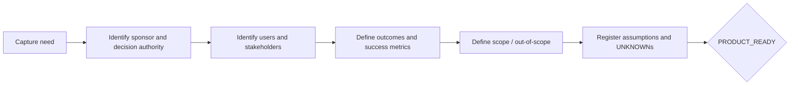

---

## 2. SECURITY_INTAKE

**Input:** Product Vision, Business Need, Stakeholder Register, Scope Baseline.  
**Control:** Constitution, applicable law/regulation, security policies.  
**Mechanism:** Security Engineer, Product, Legal/Compliance, Data Owner, KGA.  
**Output:** Security Intake, Data Classification, Regulatory Applicability, Initial Abuse Cases, Security Constraints, Security Questions Log.  
**Gate:** `SECURITY_INTAKE_READY`.

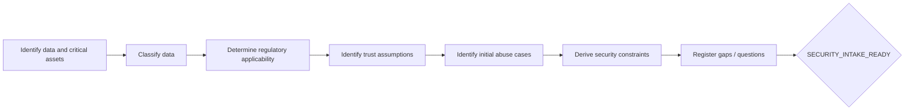

---

## 3. SYSTEM_ENGINEERING

**Input:** Product Vision, Scope Baseline, Security Intake, Data Classification, Security Constraints.  
**Control:** system-engineering standards, approved product/security constraints.  
**Mechanism:** System Engineer + Security Engineer, BA, Data/Integration/Operations engineers.  
**Output:** System Context, System Boundary, Function Model, Data Flow Model, Interface Inventory, External Dependency Register, Operational Modes, System Assumption Log.  
**Gate:** `SYSTEM_MODEL_READY`.

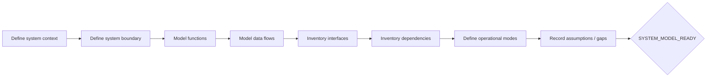

---

## 4. THREAT_MODEL_V0

**Input:** System Context, System Boundary, Data Flow Model, Data Classification, Interface Inventory, Security Constraints.  
**Control:** threat-model methodology, security policy, regulatory applicability.  
**Mechanism:** Security Engineer, System Engineer, Product, Data Owner, Skeptical Reviewer.  
**Output:** Threat Model v0, Threat Scenario Register, Trust Boundary Register, Security Requirements Draft, Security Risk Register.  
**Gate:** `THREAT_MODEL_V0_READY`.

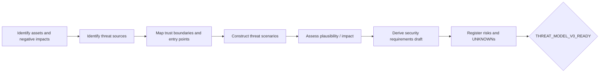

---

## 5. REQUIREMENTS_BASELINE

**Input:** Product Vision, System Context, Threat Model v0, Security Requirements Draft.  
**Control:** requirements-engineering rules, acceptance policy, applicable standards.  
**Mechanism:** Requirements Engineer, Product, System, Security, QA, Operations.  
**Output:** Business/Stakeholder/System/Software Requirements, NFR Catalogue, Security Requirements, Acceptance Criteria, Requirements Traceability Matrix.  
**Gate:** `REQUIREMENTS_BASELINE_READY`.

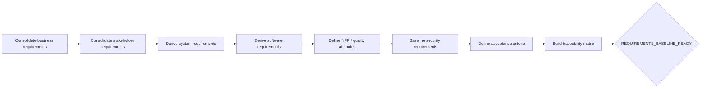

---

## 6. ARCHITECTURE_OPTIONS

**Input:** System Model Ready, Threat Model v0 Ready, Requirements Baseline Ready.  
**Control:** architecture principles, requirements, constraints, risk appetite, cost/operations limits.  
**Mechanism:** Solution Architect, System, Security, Data/Integration architects, Operations.  
**Output:** Architecture Option Set, Architecture Views, Quality Attribute Scenarios, Option Trade-off Matrix, Option Security Review.  
**Gate:** `ARCHITECTURE_OPTIONS_READY`.

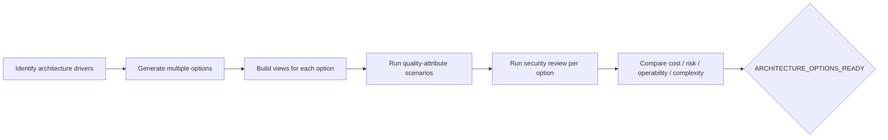

---

## 7. ARCHITECTURE_DECISION

**Input:** Architecture Option Set, Trade-off Matrix, Option Security Review.  
**Control:** constitution, decision authority, residual-risk policy.  
**Mechanism:** Solution Architect, Security Engineer, Skeptical Reviewer, Product/Owner, System/Operations.  
**Output:** ADRs, Target Architecture, Residual Risk Register, Decision Evidence Register.  
**Gate:** `ARCHITECTURE_DECISION_READY`.

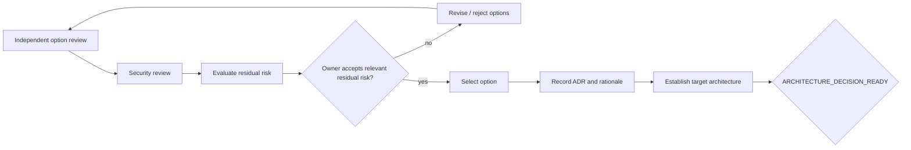

---

## 8. DETAILED_DESIGN

**Input:** Target Architecture, ADRs, Security Requirements.  
**Control:** architecture decision, design standards, secure-design constraints.  
**Mechanism:** Software Architect, Security, System, Data/API/DevOps/UX specialists.  
**Output:** Component Design, API Contracts, Data Model, IAM Model, Secrets Model, Deployment Design, Observability Design, Threat Model v1/v2, Test Strategy.  
**Gate:** `DESIGN_READY_FOR_IMPLEMENTATION`.

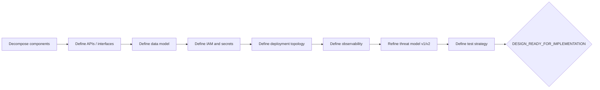

---

## 9. IMPLEMENTATION

**Input:** Component Design, API Contracts, Security Requirements, Test Strategy.  
**Control:** coding standards, configuration policy, dependency policy, secure SDLC.  
**Mechanism:** Software Engineer, Security, DevSecOps, Configuration Manager.  
**Output:** Source Code, Build Manifest, Dependency Lock, SBOM, Configuration Baseline, Code Review Records, SAST/SCA/Secret Scan Results, Unit Test Results.  
**Gate:** `IMPLEMENTATION_BASELINE_READY`.

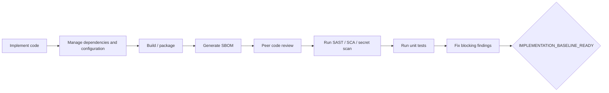

---

## 10. VERIFICATION_VALIDATION

**Input:** Implementation Baseline, Traceability Matrix, Test Strategy.  
**Control:** acceptance criteria, security requirements, architecture/design baseline.  
**Mechanism:** QA, Security, Software, Product, System, Operations.  
**Output:** Integration/System/Security/Performance/Acceptance Test Results, Defect Register, Vulnerability Register, Verification Report, Validation Report.  
**Gate:** `RELEASE_CANDIDATE_READY`.

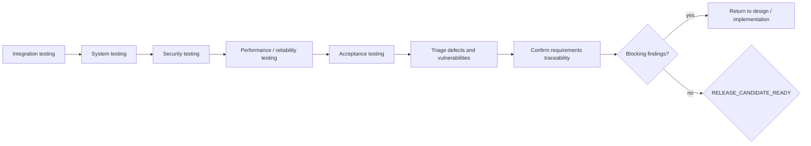

---

## 11. RELEASE_DEPLOYMENT

**Input:** Release Candidate Ready.  
**Control:** change/release policy, deployment constraints, rollback requirements.  
**Mechanism:** Release Manager, DevOps, Security, Operations, Product.  
**Output:** Release Manifest, Release Notes, Deployment Plan, Migration Plan, Rollback Plan, Change Record, Deployment Evidence, Operational Readiness Review.  
**Gate:** `PRODUCTION_READY`.

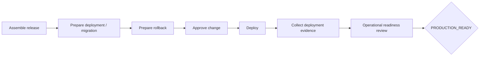

---

## 12. OPERATION_MAINTENANCE

**Input:** Production Ready.  
**Control:** SLA/SLO, operating/security policy, change policy, vulnerability-management policy.  
**Mechanism:** Operations, Service Owner, Security, SRE, Software, Incident Manager.  
**Output:** Runbooks, SLA/SLO, Monitoring Baseline, Incident/Problem/Vulnerability Records, Change Log, Capacity Reports, Security Monitoring Reports, Feedback Backlog.  
**Gate:** `OPERATION_CONTROLLED`.

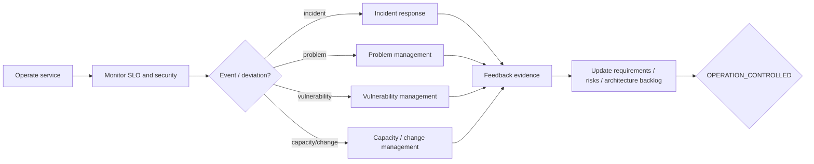

---

## 13. RETIREMENT

**Input:** Retirement Decision, current asset/dependency inventory.  
**Control:** data retention/disposition rules, contracts, legal/security obligations.  
**Mechanism:** Service Owner, System Engineer, Security, Data Owner, Legal/Compliance, Operations, Product.  
**Output:** Retirement Plan, Data Disposition Plan, Access Revocation Record, Archive Package, Dependency Decommission Record, Retirement Verification Report, Lessons Learned.  
**Gate:** `RETIRED_VERIFIED`.

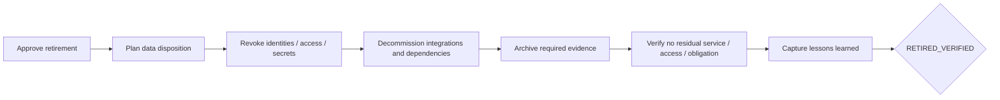

---

## Next decomposition

L2 will expand each activity into a production operation with the form:

```text
ROLE
  receives -> INPUT ARTIFACTS
  performs -> METHOD / CHECK / DECISION
  creates  -> OUTPUT ARTIFACTS
  reviews  -> REVIEW EVIDENCE
  hands to -> NEXT ROLE
```

For high-risk gates, L3 will additionally bind every check to normative source clauses and DMN rules.
