# FATHER Software Factory — Process Model

This directory is the visual/process layer above the artifact factory.

## Navigation

1. [`L0_FATHER_SOFTWARE_FACTORY.md`](L0_FATHER_SOFTWARE_FACTORY.md) — one end-to-end factory map.
2. [`L1_STAGE_DECOMPOSITION.md`](L1_STAGE_DECOMPOSITION.md) — decomposition of all 13 lifecycle stages.
3. [`stages/01-product-discovery/README.md`](stages/01-product-discovery/README.md) — Product Discovery with flow, swimlanes, IDEF0/ICOM, evidence analytics and PRODUCT_READY gate.
4. [`stages/02-security-intake/README.md`](stages/02-security-intake/README.md) — Security Intake with flow, applicability logic, early abuse cases, evidence analytics and SECURITY_INTAKE_READY gate.
5. [`FATHER_PROCESS_HIERARCHY.yaml`](FATHER_PROCESS_HIERARCHY.yaml) — machine-readable L0/L1/L2 hierarchy and implementation state.
6. [`FATHER_PROCESS_MODELING_STANDARD.md`](FATHER_PROCESS_MODELING_STANDARD.md) — BPMN/IDEF0/DMN/RACI modeling rules.

## Visual progress

```mermaid
flowchart LR
    A[01 Product Discovery\nL2 IMPLEMENTED\nPilot CONDITIONAL_PASS] --> B[02 Security Intake\nL2 IMPLEMENTED\nPilot CONDITIONAL_PASS]
    B --> C[03 System Engineering\nNEXT]
    C --> D[04 Threat Model v0\nPLANNED]
    D --> E[05 Requirements Baseline\nPLANNED]
    E --> F[06 Architecture Options\nPLANNED]
    F --> G[07 Architecture Decision\nPLANNED]
    G --> H[08 Detailed Design]
    H --> I[09 Implementation]
    I --> J[10 Verification / Validation]
    J --> K[11 Release / Deployment]
    K --> L[12 Operation / Maintenance]
    L --> M[13 Retirement]
```

## L2/L3 rule

Every L1 activity is decomposed into:

`role -> input artifacts -> operation -> decisions/checks -> output artifacts -> review -> handoff -> gate`.

Critical gates receive L3 bindings:

`normative source -> clause -> requirement -> applicability -> artifact field -> validation rule -> evidence -> DMN decision`.

Stages 01 and 02 already implement this pattern. Stage 03 `SYSTEM_ENGINEERING` is the next active decomposition.

## Analytical rule

A stage is not complete because files exist. Readiness must be explainable from evidence, owner authority, conflicts, UNKNOWNs and explicit gate rules.

The visual product should support drill-down:

`L0 factory -> L1 stage -> L2 operations/documents/roles -> L3 artifact fields/source clauses/validation rules`.

## Relationship to the factory registries

- lifecycle truth: `../FATHER_LIFECYCLE_STAGES.yaml`
- artifacts: `../FATHER_ARTIFACT_REGISTRY.yaml`
- roles: `../FATHER_ROLE_MATRIX.yaml`
- normative sources: `../NORMATIVE_SOURCE_REGISTRY.yaml`
- source/artifact mapping: `../SOURCE_ARTIFACT_MAPPING.yaml`
- architect intake crosswalk: `../ARCHITECT_INTAKE_CROSSWALK.yaml`

The diagrams are views over those canonical registries; they must not silently diverge from them.
