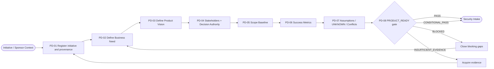
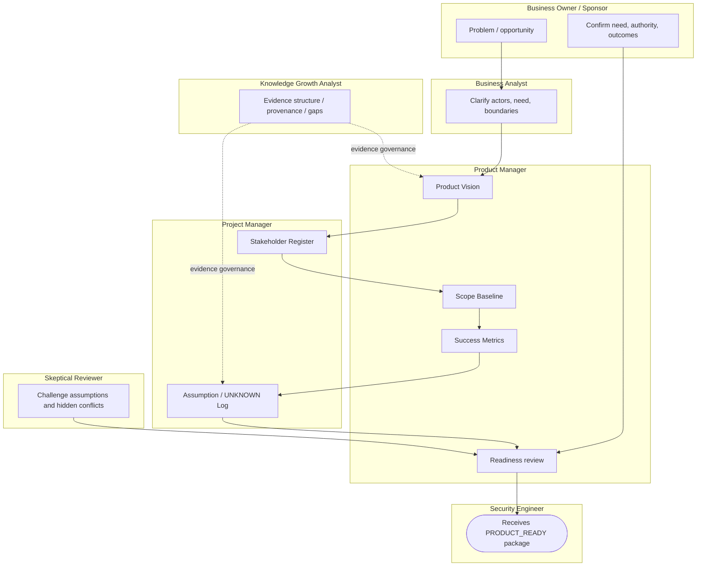

# Stage 01 — Product Discovery

Status: `CANDIDATE_PROCESS`

Goal: turn an initial initiative into an evidence-backed product context that Security can consume immediately after Product.

## L2 process map



## Role swimlanes



## IDEF0 / ICOM passport

| ICOM | Product Discovery |
|---|---|
| **Input** | business need claim, sponsor context, initiative request, existing evidence |
| **Control** | FATHER Constitution; product governance; source/provenance policy; project constraints |
| **Mechanism** | Business Owner, Product Manager, BA, PM, Knowledge Growth Analyst, Skeptical Reviewer |
| **Output** | BUSINESS_NEED, PRODUCT_VISION, SUCCESS_METRICS, STAKEHOLDER_REGISTER, SCOPE_BASELINE, ASSUMPTION_LOG, evidence register, gate decision |

## Evidence analytics

The stage is not considered complete because six files exist. Evidence quality is evaluated continuously.

```text
Statement
   ↓ classify
FACT / CLAIM / REQUIREMENT / CONSTRAINT / ASSUMPTION / PREFERENCE / HYPOTHESIS / UNKNOWN
   ↓
Source + owner + version/date
   ↓
Verification state
UNSUPPORTED / SOURCED / OWNER_CONFIRMED / CONFLICTED / REJECTED / STALE
   ↓
Affected artifact + downstream impact
   ↓
PRODUCT_READY decision
```

### Dashboard signals

| Indicator | Why it matters |
|---|---|
| Material claims total | denominator for evidence quality |
| Sourced / owner-confirmed ratio | shows how much product context has support |
| Unsupported claims | exposes invented or unverified assumptions |
| Open conflicts | prevents silent reconciliation |
| Material UNKNOWNs | shows uncertainty that may affect Security/System work |
| Artifacts with named owner | prevents orphan decisions |
| Gate blockers | shows exactly why Product cannot hand off yet |

**Important:** no numeric percentage automatically opens the gate. Metrics are diagnostic evidence, not a substitute for the decision table and professional review.

## Canonical outputs and ownership

| Artifact | Owner | Review | Next consumer |
|---|---|---|---|
| BUSINESS_NEED | Business Owner | Product Manager | Security, Requirements, System Engineering |
| PRODUCT_VISION | Product Manager | Business Owner | Security, System Engineering |
| SUCCESS_METRICS | Product Manager | Business Owner | Requirements, Validation |
| STAKEHOLDER_REGISTER | Project Manager | Product Manager | Security, System Engineering, Governance |
| SCOPE_BASELINE | Product Manager | Business Owner + PM | Security, System Engineering |
| ASSUMPTION_LOG | Project Manager | Skeptical Reviewer | all downstream roles |
| INITIATIVE_EVIDENCE_REGISTER | Product Manager / KGA governance | relevant information owners | gate + downstream evidence trace |
| PRODUCT_READY_DECISION | Product Manager | Business Owner + Skeptical Reviewer | Security Intake |

## Gate logic

`PRODUCT_READY` has four outcomes:

- `PASS` — all mandatory product context is sufficiently evidenced;
- `CONDITIONAL_PASS` — non-critical gaps remain but have explicit owners/conditions;
- `BLOCKED` — a hard blocker exists;
- `INSUFFICIENT_EVIDENCE` — evidence is not enough to determine readiness.

Hard blockers include missing decision authority, absent scope boundary, a technology request with no validated business problem, hidden material conflict, or UNKNOWN silently promoted to fact.

## Handoff to Security

Security receives the complete product package, not a verbal summary:

```text
BUSINESS_NEED
PRODUCT_VISION
SUCCESS_METRICS
STAKEHOLDER_REGISTER
SCOPE_BASELINE
ASSUMPTION_LOG
INITIATIVE_EVIDENCE_REGISTER
PRODUCT_READY_DECISION
        ↓
SECURITY_INTAKE
```

The next stage may begin only under the gate conditions in `PRODUCT_READY_DECISION_TABLE.yaml`.

## Machine-readable contracts

- `PRODUCT_DISCOVERY_PROCESS.yaml` — operations, roles, inputs/outputs and handoff;
- `PRODUCT_DISCOVERY_EVIDENCE_SCHEMA.yaml` — evidence records and analytics;
- `PRODUCT_READY_DECISION_TABLE.yaml` — DMN-like gate contract.
