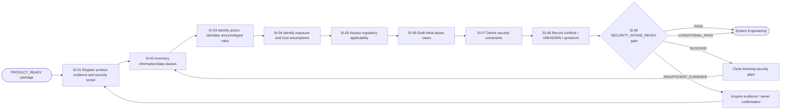
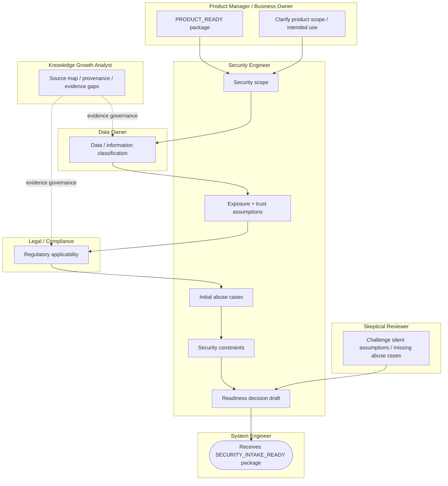

# Stage 02 — Security Intake

Status: `CANDIDATE_PROCESS`

Goal: receive the evidence-backed Product package and turn it into an explicit early security context before System Engineering proceeds: data sensitivity, exposure, identities/actors, regulatory applicability, abuse context, constraints, conflicts and UNKNOWNs.

Security enters immediately after Product and remains active downstream. This stage is **not** the final threat model. It prepares the minimum security context that System Engineering and later Threat Model v0 need.

## L2 process map



## Role swimlanes



## IDEF0 / ICOM passport

| ICOM | Security Intake |
|---|---|
| **Input** | BUSINESS_NEED, PRODUCT_VISION, SUCCESS_METRICS, STAKEHOLDER_REGISTER, SCOPE_BASELINE, ASSUMPTION_LOG, INITIATIVE_EVIDENCE_REGISTER, PRODUCT_READY_DECISION |
| **Control** | FATHER Constitution; security governance; current normative source registry; data/usage restrictions; owner-confirmed product scope |
| **Mechanism** | Security Engineer, Data Owner, Legal/Compliance, Product Manager, Knowledge Growth Analyst, Skeptical Reviewer |
| **Output** | SECURITY_INTAKE, DATA_CLASSIFICATION, REGULATORY_APPLICABILITY, INITIAL_ABUSE_CASES, SECURITY_CONSTRAINTS, SECURITY_QUESTIONS_LOG, SECURITY_INTAKE_EVIDENCE_REGISTER, SECURITY_INTAKE_READY_DECISION |

## Evidence analytics

This stage does not pass because a security questionnaire was filled in. The decision must be explainable from evidence.

```text
Product fact / data item / exposure claim / legal applicability claim
        ↓ classify
FACT / CLAIM / CONSTRAINT / ASSUMPTION / HYPOTHESIS / UNKNOWN
        ↓
Source + information owner + current version/date
        ↓
Security interpretation
DATA_CLASS / ACTOR / EXPOSURE / TRUST_ASSUMPTION / OBLIGATION / ABUSE_CASE / CONSTRAINT
        ↓
Verification state
UNSUPPORTED / SOURCED / OWNER_CONFIRMED / CONFLICTED / STALE / NOT_APPLICABLE
        ↓
Downstream impact
SYSTEM_BOUNDARY / DATA_FLOW / INTERFACE / IDENTITY / THREAT_MODEL / REQUIREMENT
        ↓
SECURITY_INTAKE_READY decision
```

### Dashboard signals

| Indicator | Why it matters |
|---|---|
| information/data classes identified | exposes what must be protected |
| sensitive/regulated classes with owner | prevents orphan handling decisions |
| external exposure assumptions | prevents hidden attack-surface assumptions |
| privileged actor/identity classes | feeds System and IAM modelling |
| applicability decisions by status | separates applicable / not-applicable / unknown |
| initial abuse cases | gives System Engineering adversarial context early |
| security constraints with evidence | makes constraints traceable rather than preference-based |
| open security conflicts | prevents silent reconciliation |
| material UNKNOWNs | keeps uncertainty visible |
| gate blockers | explains why handoff cannot proceed |

No percentage alone opens the gate.

## Canonical outputs and ownership

| Artifact | Accountable owner | Review | Next consumer |
|---|---|---|---|
| SECURITY_INTAKE | Security Engineer | Product Manager + System Engineer | System Engineering |
| DATA_CLASSIFICATION | Data Owner | Security Engineer + Legal/Compliance | System Engineering + Threat Model |
| REGULATORY_APPLICABILITY | Legal/Compliance | Security Engineer | Requirements + System + later compliance evidence |
| INITIAL_ABUSE_CASES | Security Engineer | Product Manager + Skeptical Reviewer | System Engineering + Threat Model v0 |
| SECURITY_CONSTRAINTS | Security Engineer | System Engineer | System Engineering + Requirements + Architecture |
| SECURITY_QUESTIONS_LOG | Security Engineer | relevant information owners | all downstream roles |
| SECURITY_INTAKE_EVIDENCE_REGISTER | Security Engineer / KGA governance | information owners | gate + downstream trace |
| SECURITY_INTAKE_READY_DECISION | Security Engineer | Skeptical Reviewer; unresolved legal applicability remains with Legal/Compliance | System Engineering |

## Gate logic

`SECURITY_INTAKE_READY` has four outcomes:

- `PASS` — minimum early security context is sufficiently evidenced for System Engineering;
- `CONDITIONAL_PASS` — non-blocking gaps remain with owners and explicit downstream conditions;
- `BLOCKED` — a hard security-context blocker exists;
- `INSUFFICIENT_EVIDENCE` — evidence is insufficient to determine readiness.

Hard blockers include:

- product scope and security scope materially conflict with no owner resolution;
- known sensitive/regulated information has no accountable data owner or handling decision path;
- a material legal/regulatory applicability claim is being treated as fact without authoritative review;
- a known external/privileged interaction is silently omitted from the security scope;
- a material security UNKNOWN is silently converted into an assumption/fact.

Unknown deployment topology or exact interface details do **not** automatically block this stage if they are explicitly recorded for System Engineering.

## Handoff to System Engineering

```text
PRODUCT package
SECURITY_INTAKE
DATA_CLASSIFICATION
REGULATORY_APPLICABILITY
INITIAL_ABUSE_CASES
SECURITY_CONSTRAINTS
SECURITY_QUESTIONS_LOG
SECURITY_INTAKE_EVIDENCE_REGISTER
SECURITY_INTAKE_READY_DECISION
        ↓
SYSTEM_ENGINEERING
```

System Engineering must consume these constraints while defining system context, boundaries, data flows, interfaces, dependencies and operational modes.

## Machine-readable contracts

- `SECURITY_INTAKE_PROCESS.yaml` — operations, owners, inputs/outputs and handoff;
- `SECURITY_INTAKE_EVIDENCE_SCHEMA.yaml` — evidence and analytics contract;
- `REGULATORY_APPLICABILITY_DECISION_TABLE.yaml` — applicability decision states and authority;
- `SECURITY_INTAKE_READY_DECISION_TABLE.yaml` — DMN-like stage gate contract.
