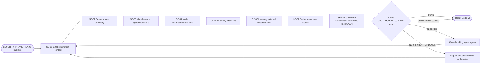
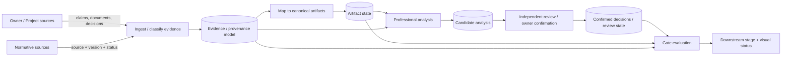
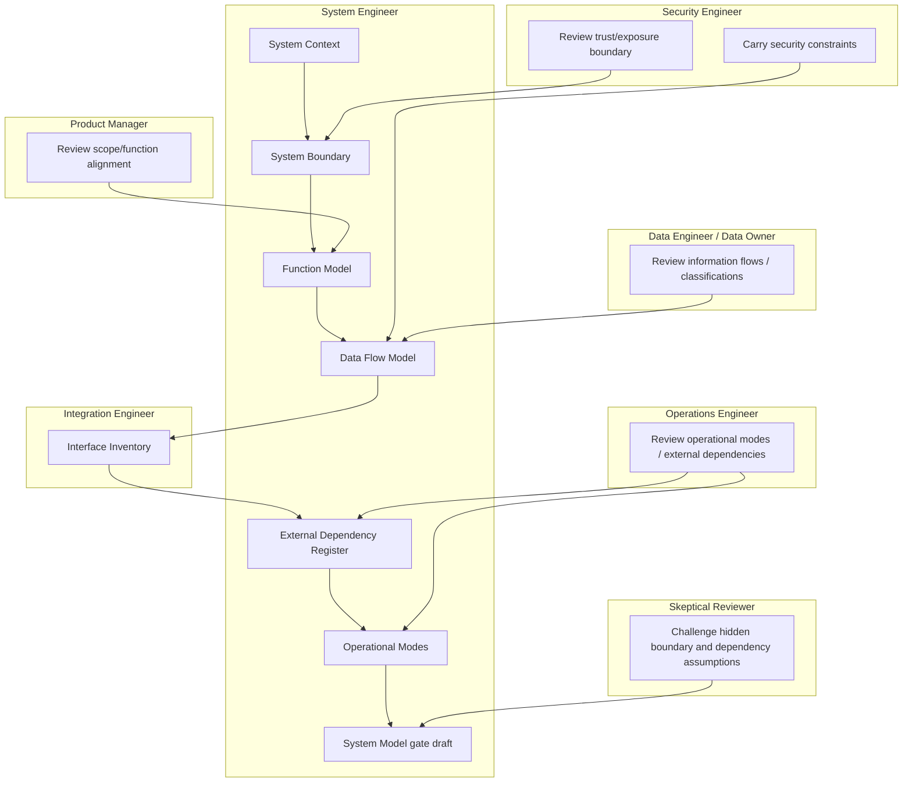

# Stage 03 — System Engineering

Status: `CANDIDATE_PROCESS`

Goal: define the system before architecture selection. The stage establishes an evidence-backed system context, boundary, functions, data flows, interfaces, external dependencies, operational modes and explicit assumptions/UNKNOWNs.

This stage does **not** select a software architecture, deployment technology, database, framework or vendor. It creates the system model that Architecture and Threat Modeling must consume.

## L2 process map



## System-context view

```mermaid
flowchart LR
    OWNER[FATHER Owner / accountable users]
    TEAM[Professional roles / reviewers]
    PROJECT[Project documents / repos / connected sources]
    NORM[Normative & professional knowledge sources]
    MODEL[LLM / agent providers]
    EXT[External systems / integrations]

    subgraph FATHER[FATHER Analytical Design Platform — system boundary]
      F1[Project intake & evidence mapping]
      F2[Lifecycle / process / gate management]
      F3[Artifact & traceability management]
      F4[Professional analysis / agents]
      F5[Visual drill-down & evidence analytics]
      F6[Independent review & decision recording]
    end

    OWNER --> F1
    TEAM --> F1
    PROJECT --> F1
    NORM --> F3
    F1 --> F2
    F1 --> F3
    F3 --> F4
    F2 --> F4
    F4 --> F6
    F6 --> F2
    F2 --> F5
    F3 --> F5
    MODEL <--> F4
    EXT <--> F1
```



The boxes inside the boundary are **logical system functions**, not approved software components.

## Core data-flow view



## Role swimlanes



## IDEF0 / ICOM passport

| ICOM | System Engineering |
|---|---|
| **Input** | Product package + Security Intake package |
| **Control** | FATHER Constitution; product scope; data classifications; security constraints; regulatory applicability status; system-engineering source doctrine |
| **Mechanism** | System Engineer, Security Engineer, Integration Engineer, Data Engineer/Data Owner, Operations Engineer, Product Manager, Skeptical Reviewer |
| **Output** | SYSTEM_CONTEXT, SYSTEM_BOUNDARY, FUNCTION_MODEL, DATA_FLOW_MODEL, INTERFACE_INVENTORY, EXTERNAL_DEPENDENCY_REGISTER, OPERATIONAL_MODES, SYSTEM_ASSUMPTION_LOG, SYSTEM_MODEL_EVIDENCE_REGISTER, SYSTEM_MODEL_READY_DECISION |

## Evidence analytics

```text
Product/security statement
      ↓
System claim
ACTOR / BOUNDARY / FUNCTION / FLOW / INTERFACE / DEPENDENCY / MODE / ASSUMPTION / UNKNOWN
      ↓
Source + owner + evidence state
      ↓
Cross-check
scope ↔ function
information class ↔ flow
external actor ↔ interface
security constraint ↔ boundary/flow
operational need ↔ mode/dependency
      ↓
Conflict / gap / UNKNOWN
      ↓
SYSTEM_MODEL_READY decision
```

### Dashboard signals

| Indicator | Why it matters |
|---|---|
| actors inside/outside boundary | shows system context completeness |
| required functions traced to product need | prevents invented functionality |
| material data classes appearing in flows | prevents invisible data movement |
| external interactions with interface owner/status | exposes integration surface |
| external dependencies with failure/trust implication | exposes hidden dependencies |
| security constraints mapped to model elements | proves Security Intake was consumed |
| open boundary conflicts | prevents architecture over an unstable scope |
| material UNKNOWNs | makes uncertainty explicit |
| gate blockers | explains readiness |

No topology or technology selection is required for `SYSTEM_MODEL_READY` unless the product context already makes it a hard constraint.

## Gate logic

`SYSTEM_MODEL_READY` outcomes:

- `PASS`
- `CONDITIONAL_PASS`
- `BLOCKED`
- `INSUFFICIENT_EVIDENCE`

Hard blockers include materially ambiguous system boundary, required product function with no system responsibility, known sensitive information with no visible flow/handling path, known external interaction omitted from interfaces, security constraint ignored without owner decision, or UNKNOWN silently converted into a design fact.

## Handoff to Threat Model v0

```text
SYSTEM_CONTEXT
SYSTEM_BOUNDARY
FUNCTION_MODEL
DATA_FLOW_MODEL
INTERFACE_INVENTORY
EXTERNAL_DEPENDENCY_REGISTER
OPERATIONAL_MODES
SYSTEM_ASSUMPTION_LOG
DATA_CLASSIFICATION
INITIAL_ABUSE_CASES
SECURITY_CONSTRAINTS
REGULATORY_APPLICABILITY
SYSTEM_MODEL_EVIDENCE_REGISTER
SYSTEM_MODEL_READY_DECISION
        ↓
THREAT_MODEL_V0
```

## Machine-readable contracts

- `SYSTEM_ENGINEERING_PROCESS.yaml`
- `SYSTEM_MODEL_EVIDENCE_SCHEMA.yaml`
- `SYSTEM_MODEL_READY_DECISION_TABLE.yaml`
