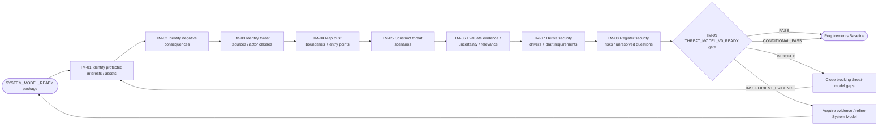
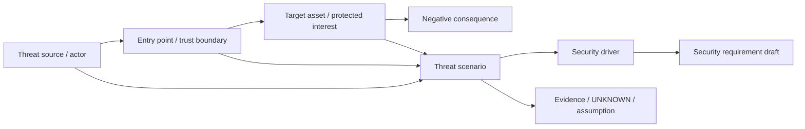
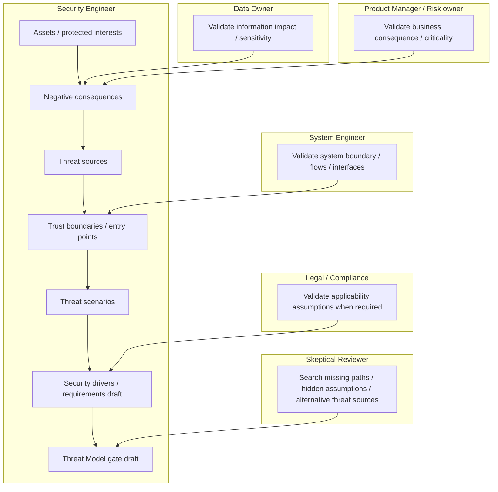

# Stage 04 — Threat Model v0

Status: `CANDIDATE_PROCESS`

Goal: create the first evidence-backed threat model from Product + Security Intake + System Model **before architecture selection**.

Threat Model v0 identifies assets/protected interests, negative consequences, threat sources, trust boundaries, plausible entry points and threat scenarios, then derives security drivers and draft security requirements. It does not pretend to know final implementation vulnerabilities, CVEs or deployment-specific likelihood.

Primary methodological source in the current registry: `FSTEC-METHOD-THREATS-2021`. The registry remains candidate and source status/applicability must be rechecked before material compliance decisions.

## L2 process map



## Threat graph view



## Threat matrix dimensions

| Dimension | Meaning |
|---|---|
| Protected interest / asset | what must not be lost, disclosed, corrupted, misused or made unavailable |
| Negative consequence | concrete harm if the security property is violated |
| Threat source | actor/source class capable of initiating or contributing to the scenario |
| Entry point | logical interaction where the scenario begins |
| Trust boundary | boundary where trust/data/authority changes |
| Preconditions | what must be true for the scenario to be plausible |
| Scenario path | evidence-backed sequence of events, not an exploit fantasy |
| Existing invariant/constraint | protections already mandated by FATHER or product context |
| Evidence state | sourced / owner-confirmed / candidate / unknown / conflicted |
| Security driver | architecture-independent property that must be addressed |
| Draft requirement | candidate requirement for Requirements Baseline |
| Deferred detail | information only available after architecture/design |

## Role swimlanes



## IDEF0 / ICOM passport

| ICOM | Threat Model v0 |
|---|---|
| **Input** | System Model package + Security Intake package + Product consequences/owners |
| **Control** | FATHER Constitution; security constraints; data classification; regulatory applicability state; admitted threat-model methodology |
| **Mechanism** | Security Engineer, System Engineer, Data Owner, Product/Risk Owner, Legal/Compliance, Skeptical Reviewer |
| **Output** | THREAT_MODEL_V0, THREAT_SCENARIO_REGISTER, TRUST_BOUNDARY_REGISTER, SECURITY_REQUIREMENTS_DRAFT, SECURITY_RISK_REGISTER, THREAT_MODEL_EVIDENCE_REGISTER, THREAT_MODEL_V0_READY_DECISION |

## Evidence analytics

```text
System element / asset / consequence / source / boundary
        ↓
Threat scenario candidate
        ↓
Evidence support + assumptions + UNKNOWN
        ↓
Cross-check against:
  all external interfaces
  all sensitive information flows
  all privileged/authority boundaries
  all external dependencies
  all initial abuse cases
        ↓
Coverage gaps / conflicts
        ↓
Security drivers + requirement drafts
        ↓
THREAT_MODEL_V0_READY
```

### Dashboard signals

| Indicator | Why it matters |
|---|---|
| protected interests with consequence owner | avoids generic “security” statements |
| external interfaces covered by scenarios or explicit rationale | attack-surface coverage |
| sensitive flows covered by confidentiality/integrity scenarios | data-risk coverage |
| authority boundaries covered | prevents agent/approval privilege gaps |
| initial abuse cases promoted/refined/rejected | trace from Security Intake |
| scenarios with explicit evidence state | prevents invented attack paths |
| security drivers mapped to scenarios | makes architecture evaluation possible |
| draft requirements traced to drivers/scenarios | feeds Requirements Baseline |
| deferred architecture-specific details | separates v0 from later v1/v2 |
| open conflicts / material UNKNOWNs | keeps uncertainty visible |

No numeric likelihood or risk score is required when deployment/architecture evidence is absent. False precision is prohibited.

## Gate logic

`THREAT_MODEL_V0_READY` outcomes:

- `PASS`
- `CONDITIONAL_PASS`
- `BLOCKED`
- `INSUFFICIENT_EVIDENCE`

Hard blockers include a material sensitive flow or external interface absent from threat coverage without rationale, a known high-consequence asset with no threat scenarios, authority/risk acceptance silently delegated to an agent, regulatory assumptions presented as verified without authority, or threat scenario invented with no system path/evidence.

## Handoff to Requirements Baseline

```text
THREAT_MODEL_V0
THREAT_SCENARIO_REGISTER
TRUST_BOUNDARY_REGISTER
SECURITY_REQUIREMENTS_DRAFT
SECURITY_RISK_REGISTER
THREAT_MODEL_EVIDENCE_REGISTER
THREAT_MODEL_V0_READY_DECISION
        ↓
REQUIREMENTS_BASELINE
```

Architecture is still not selected. The next stage converts product/system/security knowledge into a testable requirements baseline.

## Machine-readable contracts

- `THREAT_MODEL_V0_PROCESS.yaml`
- `THREAT_SCENARIO_SCHEMA.yaml`
- `THREAT_MODEL_V0_EVIDENCE_SCHEMA.yaml`
- `THREAT_MODEL_V0_READY_DECISION_TABLE.yaml`
